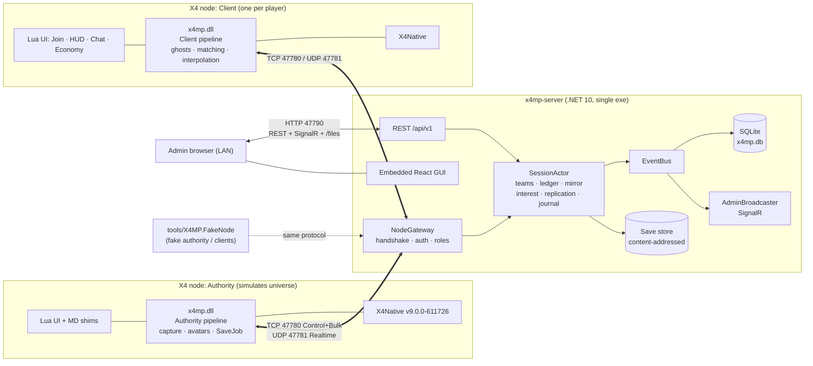
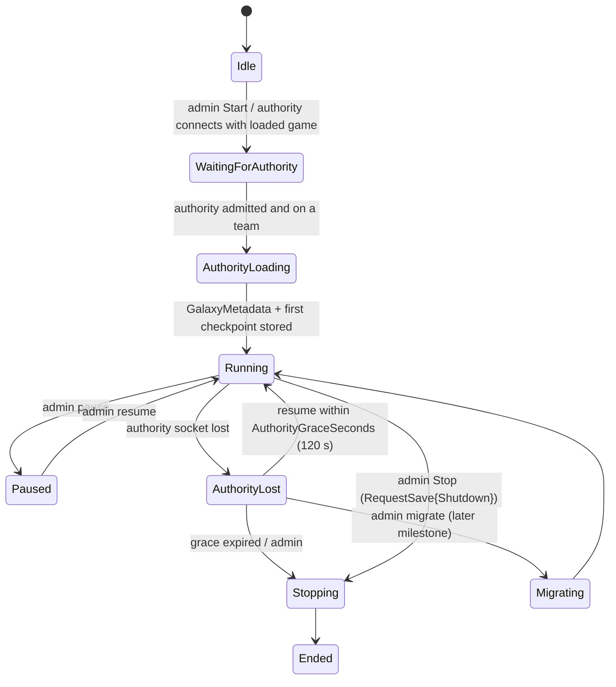

# X4MP Architecture (authoritative)

Status: v1.0, 2026-10-01 — design phase complete. **This document wins wherever a detailed
doc differs.** Decisions and their rationale are in [`decisions.md`](decisions.md)
(ADR-xxx). Plan and milestones are in [`roadmap.md`](roadmap.md).

Detailed docs (each subordinate to this one):

| Doc | Owns |
|---|---|
| [`protocol.md`](protocol.md) | Wire format, message catalog (§20), handshake, lanes, replication codec, quantisation |
| [`server-design.md`](server-design.md) | Server internals, persistence schema, admin REST/SignalR, GUI screens, FakeNode, server tests |
| [`mod-design.md`](mod-design.md) | Native module, Lua UI, MD scripts, capture/apply pipelines, ghosts, save hygiene, in-game UI |
| [`x4-api-notes.md`](x4-api-notes.md) | X4 9.00 / X4Native facts and API gaps |
| [`requirements.md`](requirements.md) | REQ-xxx / PIT-xxx catalogue from the reference audit |
| `../protocol/schema/*.fbs` | FlatBuffers schema (apply delta list ADR-036 first) |

---

## 1. Goals and non-goals

**Goals (v1):** co-op and team play for 2–8 players in one shared X4 9.00 universe;
a standalone server with a LAN web GUI; robust join/resume; teams with an
allied/neutral/hostile matrix; a server-authoritative credit ledger with transfers, pool,
donations, loans and escrowed trades; no save pollution; no Game Overs caused by the mod.

**Non-goals (v1):** shot-level combat sync, headless authority, Linux mod, internet-facing
deployment, wire compatibility with the reference mod, Egosoft's SLNet/Ventures APIs
(`NewMultiplayerGame` etc. are never called).

---

## 2. Component diagram



---

## 3. Runtime topology

- **One server process** (`x4mp-server.exe`), started first, typically on the authority's
  PC or a LAN box. It is the only listener: TCP **47780**, UDP **47781**, HTTP **47790**
  (ADR-006). Data dir: `./data` or `%ProgramData%\X4MP` as a service (`x4mp.db`, `saves/`,
  `logs/`, `uploads/`, `certs/`).
- **One authority node**: an X4 instance with the mod, role `Authority` (+ `Client` for its
  human). It simulates the universe, assigns every `net_id`, captures only the
  server-requested `CaptureSet`, applies validated intents, and makes checkpoints.
- **N client nodes**: X4 instances that load the same checkpoint, fly their own avatar
  (client-authoritative movement), render the authority's world as ghosts, and send
  intents and economy requests.
- **Admin browsers** on the LAN. **Observers** (FakeNode `inspect`) for diagnostics.
- One active session per server in v1 (design allows N).
- Start order: server → authority → clients. Pinned build: X4 9.00 / 611726 and X4Native
  `v9.0.0-611726` everywhere (ADR-004).

---

## 4. Roles and lifecycle state machines

### 4.1 Roles (PROTO §5)

| Role | Holder | May send (enforced by server `MessagePolicy`: role × phase × lane) |
|---|---|---|
| `Authority` | ≤ 1 node | `WorldUpdate`, `EntityStatusBatch`, `EntitySpawn/Despawn/Change/Cargo`, `SectorComplete`, `GameEvent`, `IntentResult`, `SaveStarted`, `SaveUpload*`, `GalaxyMetadata`, `GalaxySummary`, `StringTableAdd`, `CreditDelta` (any player/team), `AssetTransferConfirm` |
| `Client` | each player node (authority too) | `PlayerState`, `PlayerShip`, `EntityCargo` (own ship), `Intent`, `ChatSend`, team and economy requests, `CreditDelta` (self), `ResyncRequest`, `InterestHint` (cap) |
| `Observer` | tools | `ResyncRequest`, `ChatSend` |
| `Admin` flag | valid `admin_proof` | `AdminCommand` |

### 4.2 Session phases (server, `SessionPhase`)



In `AuthorityLost` replication stops; player-to-player position relay, chat and the
ledger keep working; trades in `Transferring` go `InDoubt` after timeout.

### 4.3 Node phases (server view, `NodePhase`)

```
TCP accept → Handshaking ─(ServerHello/ClientHello ok)─▶ Admitted ─▶ AwaitingTeam (skipped if sticky/Auto)
  ─▶ SyncingSave (cache check / in-band download) ─▶ Verifying (sha256) ─▶ Loading (LoadGame, stay paused)
  ─▶ Matching (manifest → ManifestReport) ─▶ CatchingUp (WorldCatchUp journal) ─▶ InGame
InGame ─(socket lost / ClientReload)─▶ Detached (ResumeGraceSeconds 60) ─(resume token)─▶ InGame (baselines reset)
Detached ─(grace expired)─▶ left;  any phase ─(reject)─▶ Failed
```

### 4.4 Mod-side connection state (MOD §2.6, §7.4)

`Offline → Connecting → Handshaking → (AwaitingTeam) → SyncingSave → Loading → Matching →
CatchingUp → InGame`, with `Resuming` (stash intent + resume token, redial backoff 1/2/4/8/10 s)
reachable from every connected state. On X4Native extension reload the mod sends
`Disconnect{ClientReload}`, writes intent/resume token/ghost registry/universe epoch to the
stash, and resumes after re-init (ADR-025). No world mutation before `on_universe_ready`
(PIT-008); gates are cleared on `on_game_loaded` and set on `on_universe_ready`.

### 4.5 Join sequence (summary; full diagram PROTO §21.1)

1. `ServerHello{nonce, supported_game_builds, …}` → `ClientHello{versions, player_key,
   HMAC proofs, resume_token, cached saves}` → `Welcome{player_id, team, faction_slot,
   TeamTable, TeamRelations, SessionSettings, udp_token}` or `Disconnect{code}`.
2. `SessionState`, `RosterUpdate`, `StringTableAdd`, `GalaxyMetadata`, `WalletUpdate`.
3. `SessionSaveInfo` → in-band download if not cached → `SaveReady`.
4. Mod activates team factions and applies relations, then `LoadGame`, stays paused at
   universe ready, matches the manifest → `ManifestReport`.
5. `WorldCatchUp` (journal since checkpoint) → `NodeReady`.
6. `PlayerShip` → authority provisions or reuses the avatar → `EntitySpawn{controller_player}`
   → client takes over the avatar (ADR-015).
7. Server computes interest → `InterestUpdate`, `EntitySpawn`s, `SectorComplete` per
   sector → client suppresses local NPCs in completed sectors, spawns ghosts → unpause →
   `InGame`, `Replication` starts.

---

## 5. Data flows

### 5.1 World replication

```
Authority (main thread, budgeted)                 Server SessionActor                         Client
  universe index (interest sectors only)            mirror: persistent (galaxy-wide) + hot       NetMap net_id→UniverseID
  read pos/rot, derive vel (finite diff)            (CaptureSet sectors) + player ships          ghosts (inert, SetObjectSectorPos)
  dead reckoning: send if err > ε(d)        ──▶  WorldUpdate (RT) ──▶ Version++ per entity  ──▶ Replication (RT, 20 Hz tick,
  EntitySpawn/Despawn/Change/Cargo (Ctl)    ──▶  journal (persistent) ─▶ fan-out by tier        field-mask vs acked baseline)
  SectorComplete after full index pass      ──▶  forward when client needs that sector  ──▶ SectorComplete → suppress locals
                                           ◀──  CaptureSet (≤1/500 ms, union of interest)
```

- Rates: Near 20 Hz (15 km sphere), Sector 5 Hz, Adjacent 1 Hz, Linger 1 Hz; player ships
  galaxy-wide ≥ 2 Hz (ADR-011). Authority internal capture tiers must meet these rates.
- Server per-client replication: priority accumulator + 256 KB/s budget; skip unchanged
  `Version`; absolute values per masked field; baselines advance on UDP ack / TCP flush;
  keyframes 5 s / 15 s; `InterestChecksum` every 5 s → `ResyncRequest` (ADR-012).
- Client player motion: `PlayerState` 20 Hz (5 Hz idle), **no velocity**; server derives
  velocity and relays it to others and to the authority at 20 Hz, which drives the avatar
  kinematically.
- Quantisation (PROTO §11): position i32 at 1/64 m sector-relative, rotation i16 Euler,
  velocity i16 at 0.25 m/s (4 m/s coarse), hull/shield u8.

### 5.2 Events and intents

Rule: **world mutations are applied; `GameEvent`s are informational** (PROTO §16).
Clients never mutate NPC/world state directly:

```
Client detects (MD hook / fallback cue / cargo diff)
  → Intent{request_key, body}  → Server: dedupe, AssetPermissionPolicy, interest/range checks
  → Authority applies on main thread (SelfDestructComponent, SetComponentOwner, MD add_cargo, SpawnStationAtPos…)
  → EntityDespawn / EntityChange / EntityCargo / EntitySpawn (journaled) + GameEvent + IntentResult
  → Server fans out; GUI event feed; session_events row
```

Bodies: `KillClaim`, `HitReport` (cap `DamageSync`), `PlayerDeath`, `StationBuildRequest`,
`TradeReport`, `CaptureReport`, `AssetOrder`, `AssetRename`, `AssetGift`. First claim wins;
intents time out after 5 s. Clients may hide a locally killed ghost optimistically for 5 s.
Station builds: the builder keeps its local station and binds it to `result_net_id` by
match key. Chat: `ChatSend` → server (rate/length limits, mute) → `ChatMessage` (All, Team,
Whisper, Admin, System).

### 5.3 Teams

- Server owns teams, membership (sticky per session), relation matrix (symmetric, sparse,
  versioned), presets, `TeamPolicy` (defaults ADR-017).
- **Symmetric faction mapping (ADR-014):** team with slot k ⇔ faction `x4mp_team_k`
  (k = 1..8) on **every** node; `player` owns only the local human's avatar. NPC owners
  travel as `owner_ref` strings; team assets carry `owner_team` / `owner_player`.
- Relations: Allied +0.75, Neutral 0, Hostile −1.0, locked; `player` ↔ own team +1.0
  (ADR-016). Applied by each node through the MD actions shim at join and on every
  `TeamRelations` change; the authority is authoritative for consequences (fights).
- Mid-session moves (admin by default): `TeamMemberChanged` → `ReassignPlayerAssets` to
  the authority (`ShipOnly` default) → `EntityChange{OwnerTeam|OwnerPlayer}` → moved client
  re-applies relations and resyncs. No other ownership changes (symmetric mapping).
- Pre-existing save assets/money → `inherit_team` once at session creation (ADR-033).

### 5.4 Economy

```
Client game spend/income ──CreditDelta{seq}──▶ ┐
Authority team-asset income ──CreditDelta{team}─▶ ├─ SessionActor EconomyService ─▶ SQLite ledger (sync commit)
Client requests (Donate/Transfer/Pool/Loan*/Trade*) ┘   (dedupe, rate, scope, balance)  ─▶ EconomyResult + WalletUpdate{acked_delta_seq}
                                                                                         ─▶ node converges local money (AddPlayerMoney)
Trade settlement: escrow ─▶ AssetTransferOrder{trade_id, lines[]} ─▶ Authority precheck/apply/compensate
                 ─▶ AssetTransferConfirm ─▶ settle or roll back (timeout → TradeQuery ×3 → InDoubt → admin)
```

- `CreditMode` Auto | PerPlayer | Shared; Auto = Shared iff exactly one team. Wallets:
  Player, TeamShared, TeamPool, Escrow, internal World. Double-entry, append-only, Σ = 0
  audited every 60 s (breach ⇒ economy freeze). Whole credits on the wire (ADR-019).
- Scopes per action Off | Teammates | Allied | Anyone (defaults: donate Teammates, loan
  Teammates, trade Allied), checked at request and at execution (ADR-020).
- Loans escrow principal at offer, `repay_total` explicit, optional auto-repay (ADR-021).
- Trades: item lists with counter/versioning, whole-trade settlement on the authority,
  `InDoubt` path, authority-simulated assets only in v1 (ADR-022).
- Overdraft from game spend is booked and flagged; requests never overdraw.

### 5.5 Saves and checkpoints (ADR-007, ADR-008)

1. Server → authority `RequestSave{reason}` (SessionStart, Autosave every 15 min,
   JoinRequested, Migration, Admin, Shutdown).
2. Authority `SaveJob` (one frame for the critical part): freeze replication, strip all
   ghost-registry objects, `SaveGame(slot "x4mp_<sessionId>_<n>")`, build manifest, send
   `SaveStarted{checkpoint_id, game_time, next_net_id}` (journal marker); restore ghosts
   after `on_game_save`.
3. Upload save then manifest on the Bulk lane (`SaveUploadBegin/Accept`, `SaveChunk`,
   `SaveChunkAck`, `SaveUploadEnd`) → server verifies SHA-256 + gzip/`<savegame` sniff →
   `SaveStored`. Only `ghosts_cleaned=true` saves become current; the journal before the
   previous checkpoint is compacted.
4. Clients get `SessionSaveInfo`; download in-band (or HTTP fallback), verify, `SaveReady`.
5. Clients never save while connected; the authority's vanilla autosave is blocked.

---

## 6. Entity identity (ADR-009, ADR-010)

| Thing | Wire identity | Assigned by | Node mapping |
|---|---|---|---|
| Any replicated entity | `net_id: u32` (never reused; `0` none) | Authority (monotonic; `next_net_id` in checkpoints + stash) | `NetMap{net_id → UniverseID, kind ghost/matched/self}` |
| Persistent statics (stations, gates, accelerators, highway entries, save-time deployables) | `net_id` from the checkpoint **manifest** | Authority | Match key `(sector macro, macro, round(pos, 50 m))`, tie-break owner → idcode → nearest ≤ 1 m |
| Sector | `u16` index (sorted macros) | `GalaxyMetadata` | index → macro → local UniverseID via `GetComponentData(id,"macro")` |
| Macro / NPC faction / ware | `u32` string-table ref | Authority, persisted by server | intern table |
| Player, team | `u16 player_id`, `u16 team_id` | Server (stable, sticky) | team → `x4mp_team_<slot>` |
| Player identity | `SHA-256(player_key)` | Mod generates key once | config file |
| Request / trade / loan | `Id128` | Client (`request_key`) / server | — |

`UniverseID`s are per process and never identify anything on the wire. The universe epoch
(random u64 at `on_universe_ready`, kept in stash) detects whether a reload brought a new
universe (clear `NetMap` and ghost registry) or was a plain `/reloadui` (keep).

---

## 7. Threading models

### 7.1 Server (ADR-024, SRV §2.1–2.3)

| Thread/task | Owns | Never |
|---|---|---|
| Per-connection reader task | decode, validate frame length before allocation, post to actor channel | touch session state |
| Per-connection writer task | drains `SendQueue` lanes Control > Realtime > Bulk, flushes, advances TCP baselines on flush | block producers |
| UDP receive loop | token → connection, ack bookkeeping | — |
| `SessionActor` (one logical thread per session) | players, teams, ledger, mirror, interest, baselines, journal, trades | await I/O; take locks |
| Hosted services | persistence writer (batched, WAL), metrics sampler, admin broadcaster (snapshot every ~250 ms), janitor, economy auditor | read actor state except via snapshots/commands |

Producers only call `TrySend` (O(1), non-blocking). Realtime is pull-model with coalescing;
Control overflow (8/32 MiB, 15 s age) closes the slow consumer; Bulk is window-controlled.
Economy mutations bypass the write-behind batcher and commit before acknowledgement.

### 7.2 Mod (MOD §2.2–2.4)

| Thread | Does | Must never |
|---|---|---|
| X4 UI/main (all X4Native callbacks) | every game API and Lua call; drains `md_ring` and `inbox`; runs resumable jobs under a frame budget (2.0 ms authority / 1.5 ms client) | block on I/O or a lock held by `net` |
| `net` (`std::jthread`) | Winsock non-blocking + `WSAPoll`, framing, FlatBuffers `Verifier`, Ping/Pong, acks, clock sync, reconnect | call game or `x4n` APIs |
| X4 MD workers | typed MD callbacks push POD `MdEvent` into lock-free `md_ring` | call game APIs, allocate, log |

Queues: `inbox` (net→main, reliable never dropped), `outbox_reliable`, `outbox_state`
(latest-wins slots), `md_ring` (MPSC, drop + count when full). All removals go through
`SafeRemove()` guarded by `PlayerGuard` (CI grep enforces it). No C++ exception crosses
into X4.

---

## 8. Interest management

Server-owned (ADR-011, PROTO §12, SRV §2.5). Per client, recomputed on sector change or
Near-grid cell change using a `SectorGraph` k-hop cache and per-sector uniform grids
(cell = `NearRadius`):

| Tier | Region | Rate | Client behaviour |
|---|---|---|---|
| Near | within 15 km of the player ship | 20 Hz | interpolate, shorter delay |
| Sector | rest of current sector | 5 Hz | interpolate |
| Adjacent | 1 gate/highway/accelerator hop (`PrefetchDepth` 1) | 1 Hz | ghosts exist and locals are hidden before arrival (no entry flicker) |
| Linger | previous sector for 20 s | 1 Hz | hysteresis against gate ping-pong |

- `CaptureSet` to the authority = union of all clients' Sector/Adjacent/Linger sectors at
  their max rate + 20 Hz focus spheres + admin map views (1 Hz, ≤ 2 per admin). Sectors are
  evicted 60 s after the last subscriber.
- `SectorComplete` gating: the authority sends it only after a full index pass; the server
  forwards it per client once all spawns are enqueued; the client suppresses local NPCs
  only after it. Absence never implies deletion.
- Ghost budget `max_ghosts` 4000: over budget, drop XS/S/M from Adjacent/Linger first, then
  limit Adjacent to the predicted route.
- `InterestHint` (cap, optional) only helps non-adjacent jumps; the server may ignore it.
- Fog of war: none in v1 (decisions Q1).

---

## 9. Persistence

| Store | Contents | Owner |
|---|---|---|
| SQLite `data/x4mp.db` (WAL) | players (key hash), bans, sessions, session_players, session_events, chat, teams, team_members, team_relations, team_assets, wallets, ledger_tx/entries (append-only triggers), economy_requests (idempotency), loans, trade_offers, economy_events, galaxy_cache, config_overrides, admin_users, api_tokens, audit_log, **journal + string table + checkpoint index** | Server (SRV §2.8 schema v1 + journal tables) |
| `data/saves/<sha256>.xml.gz`, manifests | content-addressed checkpoints | Server |
| Authority save folder | `x4mp_<sessionId>_<n>.xml.gz` (+ optional local manifest copy) | Mod (authority) |
| Client save folder | `x4mp_<sha12>.xml.gz` downloaded copies | Mod (client) |
| X4Native stash | session intent, resume token, ghost registry, NetMap, universe epoch, `next_net_id` | Mod (in-process, survives reloads) |
| Mod config and machine-local state | `%LocalAppData%\X4MP\` (M3-24: `x4mp.json`, one-shot `launch.json`, `player.key` with a machine tag, `logs\`, `ext-hash-cache.json`, `avatar-records.txt`, `authority-saves.json`, `authority\`); portable mode = the extension folder. Per machine on purpose: Documents may be OneDrive-redirected and shared by several PCs | Mod (no env vars) |
| Lua `__X4MP_USER` (uidata.xml) | last address/name, HUD/chat position; never passwords | Mod |

Retention: events/chat 30 days; unpinned unreferenced saves beyond 10 deleted.

---

## 10. Security

- Only the server listens; nodes are outbound-only. Threat model: LAN/VPN (ADR-028).
- HMAC-SHA256 challenge-response for session, admin and team passwords; `player_key`
  identity (hashed server-side); 128-bit resume tokens; identity from the connection, never
  from payload.
- Strict decoding: length checked before allocation, `Verifier`/guarded decode, NaN/∞
  rejected, strings length-capped, per-role/per-phase whitelist, > 20 violations/min ⇒
  close + 5 min IP ban, 10 s handshake, `MaxConnectionsPerIp` 4, handshake token bucket.
- Entity ownership: clients may update only their own ship's state and cargo; asset
  commands pass `AssetPermissionPolicy` (ADR-018).
- Economy: request idempotency + payload hash, synchronous commits, append-only ledger,
  conservation auditor with freeze, escrow before asset movement, one trade per asset,
  income-anomaly alerts (a compromised authority can mint via `CreditDelta`).
- Admin GUI: PBKDF2 users with forced first change, strict cookie, `X-X4MP` CSRF header,
  bearer tokens, private-network allow-list, CSP, audit log, optional self-signed HTTPS.
- Files: content-addressed, size-capped, sniff ≤ 256 KB decompressed, player-bound download
  tokens.

---

## 11. Versioning and compatibility

- **Protocol:** `major.minor` (start 0.1). Major must match; the session uses the lower
  minor; unknown message ids from a newer minor are skipped, otherwise counted as
  violations. FlatBuffers evolution rules (append fields, deprecate, never renumber ids).
  Capabilities (`common.fbs` `Capability`) gate optional features
  (`UdpRealtime`, `SaveHttp`, `InterestHint`, `DamageSync`, `Lz4Frames`, …) and report
  node health (`MdHooks`, `NativeFrameTick`, `TeamFactions`).
- **Game/X4Native:** pinned `900-611726` / `v9.0.0-611726`; mod refuses to connect on any
  other build; server enforces `supported_game_builds` and equality with the authority
  (ADR-004). Each X4 patch ⇒ new X4Native tag ⇒ new mod release (+ CI check that
  `version_db/internal_functions.json` covers every supported build).
- **Mod:** `mod_version` + `mod_build` must equal the authority's. **Extensions/DLC:**
  `extensions_hash` (DLC + simulation-affecting mods; client-only libraries excluded) must
  match, else the full list is judged by the session mod policy (ADR-043, ADR-044,
  `mod-management.md`); admin can downgrade to warning.
- **Save:** SHA-256 identity; manifest match policy (unmatched stations ≤ 0.5%).
- **Server DB:** embedded ordered migrations with `schema_version`, tested from empty and
  from the previous version.
- **GUI contract:** generated `web/src/api/generated.ts`; CI fails on drift.

---

## 12. Repository layout

```
X4MP/
├─ README.md  PLAN.md  LICENSE  .editorconfig  .gitignore  global.json
├─ Directory.Build.props  Directory.Packages.props  X4MP.sln
├─ .github/
│   ├─ workflows/ ci.yml (web · dotnet win+linux · mod windows · protocol · e2e) release.yml nightly.yml
│   └─ dependabot.yml
├─ protocol/
│   ├─ schema/*.fbs              single source of truth (FlatBuffers)
│   ├─ testdata/                 golden frames + Replication codec vectors (C#-generated, C++-verified)
│   └─ cpp/                      header-only wire helpers: frame/datagram headers, ReplicationCodec,
│                                quantisation, HMAC interface (generated headers go to build dirs)
├─ server/
│   ├─ src/ X4MP.Protocol (flatc --csharp at build + FrameCodec/ReplicationCodec/Quantize)
│   │       X4MP.Core · X4MP.Transport · X4MP.Persistence · X4MP.Server (exe x4mp-server)
│   ├─ web/                      React + Vite + TS admin GUI (embedded into the exe)
│   └─ tests/ X4MP.Protocol.Tests · X4MP.Core.Tests · X4MP.Server.Tests · X4MP.LoadTests
├─ mod/
│   ├─ CMakeLists.txt  CMakePresets.json  vcpkg.json
│   ├─ native/ core/ (pure C++) · game/ (only X4-touching code) · roles/ · features/ · bridge/ · main.cpp
│   ├─ tests/                    Catch2 (core/, roles/ via FakeGame), headless net client test
│   ├─ extension/x4mp/           content.xml ui.xml x4native.json ui/ md/ libraries/ t/ config/
│   ├─ third_party/x4native/v9.0.0-611726/   vendored SDK + runtime + version_db + LICENSE + VERSION
│   └─ tools/ deploy.ps1 · selftest · replay/
├─ tools/
│   ├─ X4MP.FakeNode/            fake authority / clients / swarm / fuzz / inspect (C#)
│   ├─ flatc/                    pinned flatc download + checksum
│   ├─ savescan/                 save-pollution scanner ([MP] objects, reference leftovers)
│   └─ installer/                Install / Check Install / Collect Logs / Uninstall (M6)
├─ docs/  architecture.md (this) · decisions.md · roadmap.md · protocol.md · server-design.md
│         · mod-design.md · x4-api-notes.md · requirements.md
├─ reference/                    read-only clone (git-ignored; never copied from)
└─ x4-unpacked/                  extracted game files for research (git-ignored)
```

Build/CI summary: `dotnet build/test` (Windows + Linux), `npm ci && build` for the GUI,
CMake + MSVC (`windows-latest`) for the mod, `flatc` schema compile + cross-language golden
vectors, e2e with published server + FakeNode swarm + Playwright, single-file release
binaries with SHA256SUMS. Details: SRV §7.2, MOD §8.2, roadmap M0.

---

## 13. Key risks (owned by the M2 spike)

| Risk | Spike | Fallback |
|---|---|---|
| Mod factions not instantiated in existing saves | S1 (V01) | Borrowed factions, mirror avatars, all teams allied |
| Avatar takeover via `TeleportPlayerTo` | S2 (V02) | Mirror model, shared ship identity |
| Ghost CPU/visual cost at 200–500 ghosts | S3 (V03) | Lower budgets, slower far updates |
| Money API semantics | S4 (V04) | Clamp + team debt, MD-only writes |
| Extension reload kills the session | S5 (V05) | Keep socket/DLL alive across re-init |
| Save control / hygiene hooks | S6 (V06) | Native hook on save export |
| NPCs cannot damage clients (gameplay gap) | V15 (M5) | Kill-claims only, GUI notice |
| Authority FPS with several client sectors | V19 (M4) | Cap captured sectors; dedicated authority PC |

Full list: decisions.md Part 3. Spike procedure: roadmap.md "M2-spike".

---

## 14. Where the detailed docs were overridden

| Topic | Overridden text | Now |
|---|---|---|
| Ports | SRV 7778/7779/7790, REQ-001 7778 | 47780/47781/47790 |
| Encoding | SRV §1.3 hand-written structs | FlatBuffers + Replication codec |
| Entity id | SRV `ulong Id = UniverseID` | `u32 net_id` |
| Faction mapping | PROTO §14.2 / SRV §2.13 own team = `player` | symmetric `x4mp_team_k` (ADR-014) |
| Player ships on authority | PROTO §13 transient mirror | persistent avatar (ADR-015) |
| Static ids | MOD §3.5 hashed station NetIds | manifest-assigned (ADR-009) |
| Pruning | MOD §4.8 `SectorManifest` | explicit `EntityDespawn` + checksum/resync |
| Client interest input | MOD §4.3 `InterestUpdate` from client | `PlayerState` only (+ optional `InterestHint`) |
| Loans | PROTO nothing reserved at offer | principal escrowed at offer |
| Trades | PROTO per-line orders incl. to clients; SRV one credits leg | per-trade order to authority, compensation, InDoubt |
| Wire money | MOD int64 cents | int64 whole credits |
| Build mismatch | PROTO/SRV warning by default | always reject |
| Save download in mod | MOD "M6 over HTTP" | in-band in M2 |
| Autosave | PROTO 20 min, mod-side timer | 15 min, server-driven |
| Lane caps | SRV 2/8 MiB | 8/32 MiB |
