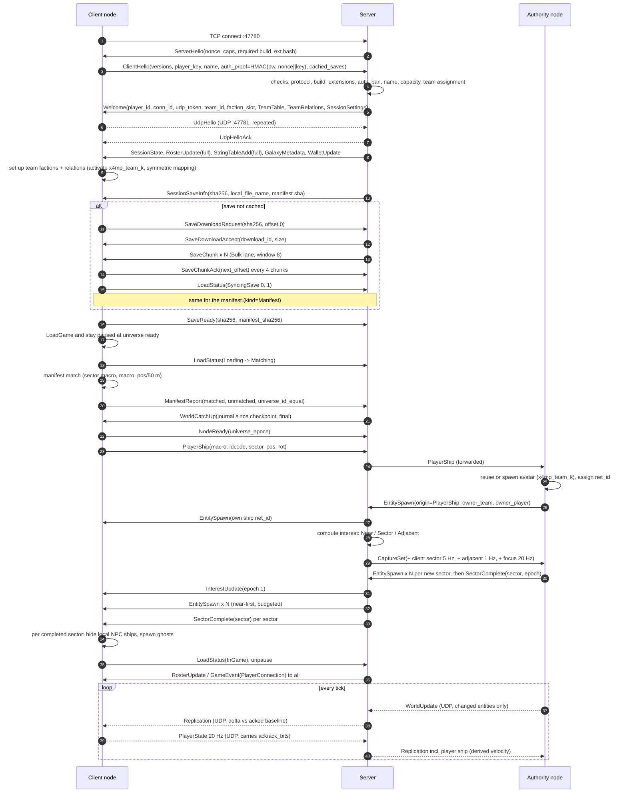

# X4MP Network Protocol — v0.1 (draft)

> See docs/architecture.md — it is authoritative where this doc differs.

Status: design draft for M0/M1.
- Schema: `protocol/schema/*.fbs` (FlatBuffers; not yet compiled with `flatc`). Apply the
  schema delta list in `decisions.md` ADR-036 (task M0-03) before codegen.
- Aligned with `docs/server-design.md`, `docs/mod-design.md`, `docs/x4-api-notes.md` and
  `docs/requirements.md`. Conflict resolutions are recorded in `docs/decisions.md`. This
  document wins over server-design.md and mod-design.md on wire matters.
- Reference repo used for lessons only. No code is reused.

Terms:

| Term | Meaning |
|---|---|
| **Server (S)** | Standalone C#/.NET 10 process. Owns session, auth, teams, ledger, interest, world mirror, replication, saves, GUI. Never runs X4. |
| **Node (N)** | Any X4 instance running our mod and connected to the server. |
| **Authority (A)** | The one node that simulates the universe. It is the source of truth for NPC entities and assigns every `net_id`. |
| **Client (C)** | A player node. It simulates its own ship, renders everything else as ghosts, and sends intents and requests. |
| **Ghost** | An entity the mod spawns on a node to show something that node does not simulate. |
| **Persistent entity** | Stations, gates, accelerators, highway entries, satellites, beacons, probes, mines and laser towers. These are tracked universe-wide and journaled. |
| **Transient entity** | Ships, drones, lockboxes and crates. These are tracked only while inside the authority's capture set. |
| **Team** | A group of players sharing one in-game faction. Each team maps to a faction slot (`x4mp_team_<slot>`). |

---

## 1. Design summary

1. **Three lanes over two sockets.**
   - **Control**: reliable and ordered, on TCP.
   - **Realtime**: latest-wins state, on UDP when available, otherwise TCP.
   - **Bulk**: windowed in-band save chunks on TCP, sent only when the other lanes are
     idle.

   HTTP on the admin port is an optional fallback for saves and is the admin GUI's
   transport.
2. **Frames.** Each frame has a fixed binary header (length, `u16` type, flags) and a
   FlatBuffers payload, one table per message id. The server-to-client replication payload
   is a small hand-specified packed codec inside a `[ubyte]` field.
3. **The server keeps a world mirror and computes per-client deltas.**
   - The authority captures only the **CaptureSet** the server asks for. That set is the
     union of all clients' interest.
   - The authority sends quantised full state for entities whose state changed
     (`WorldUpdate`, with authority-side dead reckoning).
   - The server keeps the latest state per entity, owns interest tiers, and sends each
     client a `Replication` delta against that client's **acked baseline**. Over UDP the ack
     comes from the datagram header; over TCP it comes from the writer flush.
4. **Ghost rendering is the client model.** In sectors where a client receives
   entities, it hides its own local NPC ships, but only after the server's
   `SectorComplete` marker. It then shows the authority's ships as ghosts keyed by
   `net_id`. Persistent entities (stations and similar) are bound once through a
   checkpoint **manifest**, using stable keys (sector macro, macro, rounded position).
   `UniverseID`s are never identities on the wire.
5. **Server-owned tiered interest:**
   - **Near**: within 15 km, 20 Hz.
   - **Sector**: the rest of the current sector, 5 Hz.
   - **Adjacent**: prefetch of sectors one hop away, 1 Hz.
   - **Linger**: the previous sector for 20 s, 1 Hz.

   Clients only report position and sector. Ghosts in adjacent sectors already exist and
   have converged before the player arrives. This fixes the reference's sector-entry
   divergence flicker.
6. **No client velocity.** X4 exports no velocity getter. The authority derives velocity
   by finite difference and sends it. The server derives player-ship velocity from
   consecutive `PlayerState` samples.
7. **Intents and facts.**
   - Clients never mutate NPC or world state directly. They send an `Intent` (kill claim,
     asset order, trade, capture, build).
   - The server validates it, including team permission checks, and forwards it to the
     authority.
   - The authority applies the intent. It emits world mutations, which nodes apply, and a
     `GameEvent`, which is informational only.
8. **Teams.** Teams are server-owned and per session. They have their own faction slot
   and a relation matrix. Assignment, the full roster and the matrix arrive in `Welcome`.
   Every entity carries `owner_team` and `owner_player`.
9. **Economy.** The server ledger is the single source of truth for credits:
   - per-player wallets, teammate transfers and an optional team pool;
   - a single shared wallet when there is only one team (`CreditMode` Auto, PerPlayer or
     Shared);
   - gifts, loans and **escrowed trades**, each gated by a scope setting.

   Every request carries an idempotency key.
10. **Checkpoints and the journal.**
    - A checkpoint is a save made by the authority, plus an ordering marker
      (`SaveStarted`) and an uploaded manifest.
    - The server journals persistent mutations after the marker.
    - Joiners load the checkpoint and then replay the journal.

---

## 2. Serialization: IDL choice

Constraints:
- **C++ side:** inside an MSVC game DLL loaded by X4Native. No heavy dependencies, no
  static-init surprises, no exceptions across the game boundary.
- **C# side:** .NET 10 with codegen. It must decode untrusted input safely.
- **Tests:** a Python fake client and fake authority must be able to speak the protocol.

| Option | C++ in a game DLL | C# | Schema evolution | Hot path | Verdict |
|---|---|---|---|---|---|
| **FlatBuffers** | Header-only runtime plus generated headers. No link library, no exceptions needed, MSVC supported. Includes `flatbuffers::Verifier`. | `Google.FlatBuffers` NuGet plus `flatc --csharp`. Bounds-checked reads. | Good: append fields, `deprecated`, omitted defaults | Vectors of `struct`s are packed arrays (32 B per `EntityState`) | **Chosen** |
| Protobuf | `libprotobuf` is large and pulls Abseil (≥ 22.x). Static init and CRT issues. Lite is still heavy. nanopb is C-only. | Excellent | Excellent | varint and tags, ~40–50 B per entity | Rejected: dependency weight in the DLL |
| MessagePack | msgpack-cxx needs Boost unless `MSGPACK_NO_BOOST` | Excellent | **No shared IDL**, so two hand models drift | ~40 B per entity | Rejected: no single source of truth |
| Hand-rolled LE structs | Trivial and smallest | Trivial with `BinaryPrimitives`. Preferred by server-design.md §1.3. | Manual. Every message is written three times (C++, C#, Python). | Best | Used **only** for the `Replication` entry codec (§10.2). |

**Decision.**
- **FlatBuffers is used for every message table.** One table per message is identified by
  the `u16` id in the frame header (`message_ids.fbs`). No top-level union is used, so
  relays and skips stay cheap. Unions appear only inside closed sets: intent bodies, event
  bodies, admin bodies and journal entries.
- The **server-to-client `Replication` payload** is a field-mask delta. FlatBuffers would
  waste a vtable per entry, so it is a hand-specified, byte-exact codec carried in
  `Replication.entries:[ubyte]`. The codec is tiny: about 60 lines per language, and it is
  covered by golden vectors.
- On the server side, the extra package is `Google.FlatBuffers`. That conflicts with
  server-design.md §1.3's preferred "no package" outcome; resolved by ADR-005.

Build and test:
- Pin one `flatc` version in `tools/flatc/`.
  - CMake: `add_custom_command(flatc --cpp --scoped-enums)`.
  - MSBuild target: `flatc --csharp`.
  - Python bindings: `flatc --python`, for FakeNode-style Python tools.
- **Golden vectors** live in `protocol/testdata/*.bin`. They are encoded by C# and
  decoded and re-encoded by C++ and Python tests. CI fails on any difference. The
  `Replication` codec and quantisation have their own byte-exact vectors.
- **Decode policy.** The C++ side runs `Verifier` on every inbound frame. The server
  decodes inside try/catch. A failure means `Disconnect(MalformedMessage)`, and it counts
  toward the violation limit.
- The **web GUI does not use this protocol**. It uses REST plus SignalR JSON.

---

## 3. Transport

### 3.1 Ports (defaults; each configurable)

| Port | Proto | Use |
|---|---|---|
| **47780/tcp** | TCP | Game connection: Control lane, Bulk lane, and the Realtime lane when UDP is unavailable |
| **47781/udp** | UDP | Realtime lane (optional, capability `UdpRealtime`) |
| **47790/tcp** | HTTP(S) | Admin GUI, REST, SignalR, save upload and download (admin, and optional node fallback) |

The defaults use the uncommon 4778x/4779x range. The reference used 7777 and 7778, and
the earlier server-design draft used 7778/7779/7790. Moving avoids collisions with the
reference mod, common game servers and dev tools.

Only the server listens. Nodes only dial out. Node configuration (address, name,
password hash cache, `player_key`) lives in the mod's **config file**, never in
environment variables, because a Steam relaunch drops them.

### 3.2 TCP framing

```
offset size field
0      4    payload_len   u32 LE: bytes after this 8-byte header (max MaxFrameBytes, default 1 MiB;
                           validated BEFORE allocating)
4      2    msg_type      u16 LE (MsgType)
6      1    flags         bit0 Compressed (LZ4 block, cap Lz4Frames; payload = u32 raw_len + block)
                          bit1..7 reserved = 0
7      1    lane          0 Control, 1 Realtime, 2 Bulk (informational; must match the catalog)
8      N    payload       FlatBuffers buffer of the table named by msg_type
```

- The 8-byte header keeps the payload 8-byte aligned, which FlatBuffers needs for
  `ulong` and `double`.
- Chunked content (`SaveChunk` at 256 KiB or less, `WorldCatchUp` at 256 KiB or less)
  always fits under `MaxFrameBytes`.
- Unknown `msg_type`:
  - If the peer's negotiated minor version is higher than ours, the frame is skipped and
    logged.
  - Otherwise it counts as a violation (server-design.md §7.3: more than 20 per minute
    means `Disconnect(TooManyViolations)` and a 5-minute IP ban).
- `TCP_NODELAY` is on. The writer drains lanes in strict priority order:
  **Control > Realtime > Bulk** (server-design.md §2.3).

### 3.3 UDP datagram (Realtime lane)

```
offset size field
0      2    magic       0x4D58 ("XM")
2      1    proto_major
3      1    flags       reserved = 0
4      4    conn_id     from Welcome
8      4    seq         sender's datagram sequence (per direction)
12     4    ack         highest seq received from the peer
16     4    ack_bits    bit i = (ack - 1 - i) also received (32-packet window)
20     4    reserved    = 0 (keeps sub-messages 8-aligned)
24     ...  sub-messages: u16 msg_type | u16 len | payload[len] | zero pad to 8-byte boundary
```

- The maximum datagram size is **1200 bytes**, which is MTU-safe across WireGuard,
  Tailscale and PPPoE. One message never spans datagrams.
- Allowed on UDP: `Ping`, `Pong`, `UdpHello`, `UdpHelloAck`, `Replication`,
  `WorldUpdate`, `EntityStatusBatch`, `PlayerState`. Anything else is dropped and counted.
- **Acks drive delta baselines (§10.3).** Every datagram carries `ack` and `ack_bits`.
  A side with nothing to send for 50 ms while it has unacked inbound sends a bare header
  (24 bytes), which is an ack-only datagram. Clients normally piggyback acks on
  `PlayerState` at 20 Hz.
- **Binding:**
  1. After `Welcome`, the node sends `UdpHello{conn_id, udp_token}` every 250 ms until it
     gets `UdpHelloAck`.
  2. The server binds `conn_id` to that source endpoint. Datagrams from any other endpoint
     are dropped until a valid `UdpHello` re-binds (NAT rebinding).
  3. If there is no ack within 3 s, the Realtime lane runs over TCP and
     `NodeStats.udp_active` is false. `udp_token` is a 64-bit secret.
- Datagrams with `seq` older than the last seen value minus 64 are dropped.

### 3.4 Lanes

| Lane | Carrier | Semantics | Overflow policy (server; the mod mirrors it) |
|---|---|---|---|
| **Control** | TCP | Reliable, ordered, never dropped | Soft cap 8 MiB: pause spawn and catch-up producers. Hard cap 32 MiB: `Disconnect(SlowConsumer)`. |
| **Realtime** | UDP (preferred) or TCP | Latest-wins. A pending frame with the same coalesce key is **replaced**. Pull model (`CanAcceptRealtime` below a 64 KiB low watermark). | Above 256 KiB: drop. Baselines are not advanced (§10.3), so nothing desyncs. |
| **Bulk** | TCP | Windowed (8 × 256 KiB, acked every 4 chunks). Drained only when Control and Realtime are empty. | Flow-controlled by `SaveChunkAck`. It never overflows. |

The catalog (§20) fixes each message's lane.

### 3.5 Threading rule (mod side, normative)

- All socket I/O, framing, Ping/Pong replies, acks and `Verifier` run on a **dedicated
  network thread**.
- The game main thread only drains an inbound SPSC queue and fills the outbound queues
  during the frame update. Sends never block.
- Heartbeats keep flowing through game hitches and 180 s save loads. The reference lost
  most of its FPS to a blocking send.

---

## 4. Handshake, versioning, auth

### 4.1 Sequence

```
TCP connect :47780
S -> N  ServerHello   {protocol ver, server caps, nonce[32], phase, required build/mod/extension hash}
N -> S  ClientHello   {versions, extensions, player_key[32], name, requested roles, caps,
                       auth_proof, admin_proof, resume_token, last_journal_seq, loaded/cached saves,
                       preferred_team}
S -> N  Welcome {ids, caps, conn_id/udp, timers, team_id, team_role, faction_slot,
                 TeamTable(full), TeamRelations(full), SessionSettings(incl. CreditMode)}
        or Disconnect{code, message, expected}, then close
N -> S  UdpHello (UDP, repeated);  S -> N UdpHelloAck
S -> N  SessionState, RosterUpdate(full), StringTableAdd(full), GalaxyMetadata (if a universe exists),
        WalletUpdate (own + team wallets)
```

The whole handshake must complete within **10 s** of the TCP accept, otherwise the
server sends `Disconnect(HandshakeTimeout)`.

### 4.2 Compatibility checks (server, in order)

| Check | Rule | Failure code |
|---|---|---|
| Protocol | `major` must be equal. The session uses the lower `minor`. | `ProtocolMismatch` |
| Mod | Equal to `required_mod_version` if pinned, else to the authority's. `mod_build` is compared in strict mode. | `ModVersionMismatch` |
| Game build | In `supported_game_builds` (pinned `900-611726`) **and** equal to the authority's `game_build`. Always enforced (ADR-004). | `GameVersionMismatch` |
| Extensions | Fast path: `extensions_hash` equal to the authority's. The hash covers enabled DLCs and enabled `Sim`-class extensions only; the client-only library allowlist (`kuerteeUIExtensionsAndHUD`, `ws_3477279743`, `ws_2042901274`, `ws_3514258146`) and `x4native`/`x4mp` are excluded (ADR-043). On a mismatch the server evaluates the full `extensions:[ExtensionInfo]` list against the session `ModPolicy` (Required / Allowed / Blocked, default for unknown mods; [mod-management.md](mod-management.md) §3) and rejects only if the policy is violated. Library differences are info only. The policy's `enforcement` can downgrade a violation to a warning. | `ExtensionsMismatch` + `ModPolicyViolation` detail |
| Auth | Valid `auth_proof` (when a password is set). Failures are delayed 1 s; limit 5 per minute per IP. | `AuthFailed` |
| Ban | `SHA-256(player_key)` and source IP not banned | `Banned` |
| Name | 3–24 chars. The name stays bound to the first key seen with it. | `NameTaken` |
| Capacity | `max_players`, `MaxConnectionsPerIp` (default 4) | `SessionFull` |
| Role | `Authority` requested while one is live, unless this node is the designated authority or an admin promotes it | `RoleUnavailable` |
| Team | `NewTeamPerPlayer` and no free faction slot | `NoFactionSlot` |

### 4.3 Auth (challenge-response; the password never crosses the wire)

- **Session password:**
  `auth_proof = HMAC-SHA256(key = SHA256(utf8(password)), msg = nonce || player_key)`.
  - The server stores only `SHA256(password)` and recomputes the proof. A replay is
    useless because the nonce is fresh per connection.
  - The C++ side uses Windows `BCrypt*`, an OS library.
- **Admin password:** same construction in `admin_proof`. A valid proof grants
  `Role.Admin`. Web GUI admin login is separate: PBKDF2 plus cookie, see server-design.md
  §4.2.
- **Team password** (lobby, when a team is protected):
  `TeamChoice.password = HMAC-SHA256(SHA256(team password), nonce || player_key)`.
- **`player_key`:**
  - 32 random bytes, created once and stored in the mod's config file. It is an identity,
    not a password.
  - The server stores `SHA-256(player_key)`.
  - It ties the node to its roster entry, team membership, wallet, loans and bans.
  - A second connection with the same key closes the first with
    `SupersededByNewConnection`.
- **Resume token:**
  - 128 random bits from `Welcome`, valid for `resume_grace_s` (default **60 s**) after the
    socket drops.
  - When `resume_token` and `player_key` both match, the node gets the same `player_id`,
    team, ship and baselines reset (`resumed = true`).
- **Transport security:** none in v0 (LAN or VPN). TLS over TCP (`SslStream`, cap `tls`)
  and DTLS are deferred.

---

## 5. Roles

| Role | Held by | Exclusive sends (checked by `MessagePolicy`, server-design.md §2.4) |
|---|---|---|
| `Authority` | At most one node per session | `WorldUpdate`, `EntityStatusBatch`, `EntitySpawn`/`Despawn`/`Change` (any entity), `SectorComplete`, `GameEvent`, `IntentResult`, `RequestSave` replies (`SaveStarted`, `SaveUpload*`), `GalaxyMetadata`, `StringTableAdd`, `CreditDelta` (any player), `AssetTransferConfirm` (NPC-simulated assets) |
| `Client` | Player nodes. The authority usually also holds Client, because the host plays. | `PlayerState`, `PlayerShip`, `EntityCargo` (own ship), `Intent`, `ChatSend`, team requests, economy requests, `CreditDelta` (self), `AssetTransferConfirm` (own piloted ship), `ResyncRequest`, `InterestHint` (optional) |
| `Observer` | Tools (FakeNode inspector) and spectators | `ResyncRequest`, `ChatSend` |
| `Admin` (flag) | Any node with a valid `admin_proof` | `AdminCommand` |

**Entity ownership enforcement:** a client may only update its own ship's state and
cargo. Violations are dropped and counted, and after N of them the client is kicked.
**Permission enforcement** for team assets is described in §16.2.

---

## 6. Session lifecycle

### 6.1 Session phases (`SessionPhase`, server-design.md §2.4)

```
Idle ─(admin selects save + Start, or authority connects with a loaded game)─▶ WaitingForAuthority
WaitingForAuthority ─(authority admitted, on a team)─▶ AuthorityLoading
AuthorityLoading ─(GalaxyMetadata + first checkpoint stored)─▶ Running
Running ⇄ Paused (admin)
Running ─(authority socket lost)─▶ AuthorityLost ─(resume within grace)─▶ Running
AuthorityLost ─(grace expired / admin)─▶ Migrating (later) or Stopping
Running ─(admin Stop)─▶ Stopping (RequestSave{Shutdown}, notify) ─▶ Ended
```

In `AuthorityLost`, replication stops, but player-to-player relay (positions, chat) and
the economy ledger keep working.

### 6.2 Node phases (`NodePhase`)

`Admitted → AwaitingTeam → SyncingSave → Verifying → Loading → Matching → CatchingUp → InGame`.
On the server, a node can also be `Detached` (inside resume grace) or `Failed`.
`AwaitingTeam` is skipped when a membership is sticky or `JoinMode = Auto`.

### 6.3 Checkpoints (authority save → session save)

1. S → A: `RequestSave{request_id, reason, slot_name}`. Reasons include `SessionStart`,
   `Autosave` (every `AutosaveMinutes`), `JoinRequested`, `Migration`, `Admin` and
   `Shutdown`.
2. **In one frame**, the authority does the following:
   - removes or hides every tagged ghost (save hygiene, a reference lesson; avatars stay);
   - calls `SaveGame(slot, name)`;
   - builds the **manifest** (§8.4);
   - sends **`SaveStarted{checkpoint_id, game_time, next_net_id}`** on the Control lane;
   - restores the ghosts.

   `SaveStarted` is the **journal ordering marker**. Every world mutation the authority
   sent before it is inside the save, and everything after it is not. The server records
   the journal position there.
3. A → S: `SaveUploadBegin{checkpoint_id, kind=Save, size, sha256, name, ghosts_cleaned}`.
   S → A replies `SaveUploadAccept{upload_id, chunk_size=256 KiB, resume_offset, window=8}`.
4. A streams `SaveChunk{transfer_id, offset, data}` on the **Bulk** lane. S → A sends
   `SaveChunkAck{next_offset}` every 4 chunks. A finishes with `SaveUploadEnd`.
5. The server verifies SHA-256 and the gzip/`<savegame` sniff, then stores the file
   content-addressed. If `ghosts_cleaned == false`, the save is stored but flagged and not
   made current. The server replies `SaveStored{result}`.
6. Steps 3 to 5 repeat with `kind = Manifest`.
7. When both are stored, the save becomes the session's **current save**. The server
   broadcasts `SessionState.current_save_sha256` and `SessionSaveInfo`, and compacts the
   journal before the previous checkpoint.

Notes:
- The authority's own autosave is disabled by the mod. A manual save by the authority
  player follows the same path with `request_id = 0`.
- If the authority starts on a save the server has never seen, the server issues
  `RequestSave{SessionStart}` before admitting clients.

### 6.4 Save distribution to nodes

1. S → N: `SessionSaveInfo{checkpoint_id, sha256, size, local_file_name =
   "x4mp_<sha12>.xml.gz", manifest_sha256, http_url?, download_token}`.
2. The node looks for `local_file_name` in its X4 save folder, verifies it, and caches
   the hash by mtime and size.
3. If the file is missing, use one of these:
   - **In-band (default):** send `SaveDownloadRequest{sha256, kind, offset}`. The server
     replies `SaveDownloadAccept{download_id, size, chunk_size, window}`, then sends
     windowed `SaveChunk`s on the Bulk lane, which the node acks with `SaveChunkAck`. To
     resume, send the request again with the current offset.
   - **HTTP (cap `SaveHttp`, fallback):** `GET /files/saves/{sha256}` on :47790 with
     `Authorization: X4MP-Download <token>`, `Range`, `If-Range` and `ETag = sha256`.
     Tokens last 1 h and are bound to the player.
4. Same for the manifest.
5. The node writes `.part`, verifies SHA-256, renames the file, and sends `SaveReady`.
   The server moves the node to `Loading`. Progress is reported through `LoadStatus` (at
   most 2/s) and shown in the GUI.

The server-wide Bulk egress cap is `SaveBandwidthCapMBps`. Bulk never delays other
players' Control or Realtime traffic, because each connection has its own queue and Bulk
is lowest priority.

### 6.5 Joining a running session

The sequence diagram is in §21.1. Summary:
1. Handshake. Team assignment happens in `Welcome`, or via lobby or admin in
   `AwaitingTeam`.
2. Save sync.
3. `LoadGame`. The node stays **paused** at universe ready.
4. Manifest match, then `ManifestReport`.
5. `WorldCatchUp` (journal since the checkpoint).
6. `NodeReady`, then `PlayerShip` and `EntitySpawn` (own `net_id`).
7. The server computes interest and sends `InterestUpdate`, `EntitySpawn`s and
   `SectorComplete` per sector. The client hides local NPCs in each completed sector.
8. `Replication` starts, the node unpauses, and the server sets `InGame`.

**Join policy** (`join_checkpoint_policy`):
- `latest_plus_journal` (default): no hitch on the authority.
- `fresh_save`: when the journal is longer than N entries or the checkpoint is older than
  M minutes, issue `RequestSave{JoinRequested}`.

### 6.6 Reconnect

1. When the socket drops, the node keeps playing. Ghost extrapolation freezes after
   500 ms (1 s for the Adjacent tier).
2. The node redials with backoff (1, 2, 4, 8, max 10 s) and sends `resume_token`,
   `last_journal_seq` and `loaded_save_sha256`.
3. If the resume is accepted:
   - The server sends `WorldCatchUp` from `last_journal_seq + 1`. If that range was
     compacted, it forces a reload instead.
   - It **clears this client's baselines**. Replication then re-sends spawns for the
     whole interest set, near-first and spread over ticks by the budget, followed by
     `SectorComplete` markers.
4. `ResumeExpired` means a fresh join.

### 6.7 Authority migration (later milestone; messages reserved)

**Planned** (admin `MigrateAuthorityCmd`):
1. The session enters `Migrating`.
2. The old authority receives `RequestSave{Migration}` and uploads.
3. The old authority receives `AuthorityAssign{grant=false}` and becomes a client.
4. The target receives the save plus `AuthorityAssign{grant=true, checkpoint,
   next_net_id, string_table_next}` and the full `StringTableAdd`. It loads, matches the
   manifest and **adopts its `net_id`s**, then continues allocation from `next_net_id`.
5. The server resends `CaptureSet`. The new authority sends spawns and `SectorComplete`.
6. The server clears every client's baselines and sets `Running`.

**Unplanned** (authority lost): the same steps start from the last checkpoint.
Progress since that checkpoint is lost, and the GUI says so.

server-design.md has the other clients reload on handoff. This protocol does not need
that, because persistent ids carry over through the manifest and transient ships are
re-spawned; reload remains the simple fallback. Symmetric team factions (ADR-014) mean a
new authority re-owns nothing.

---

## 7. Heartbeat, RTT, clock sync, interpolation

- **Ping/Pong** every `heartbeat_interval_ms` (1000) on TCP in both directions, and also
  on UDP when bound. The network thread answers.
  - Any inbound frame resets liveness.
  - After `heartbeat_timeout_ms` (10000), the connection is closed with `HeartbeatTimeout`
    and the node goes to `Detached`.
- **RTT** = `now − echo_send_time_us − (reply_time_us − recv_time_us)`, smoothed with an
  EWMA (α = 1/8). Reported in `NodeStats` and `PlayerInfo.ping_ms`.
- **Clock:**
  - The server clock is monotonic µs since server start (`*_time_us`).
  - Each node keeps 16 samples and uses the one with the **lowest RTT**:
    `offset = recv_time_us + rtt/2 − local_now`.
  - The offset is slewed by at most 1 ms per second, or stepped if the error exceeds
    50 ms. `server_now = local_monotonic + offset`.
- **Stamping:**
  - The authority stamps `WorldUpdate.capture_time_us` with its `server_now` estimate.
  - Clients stamp `PlayerState.sample_time_us` the same way.
  - The server converts each entry's sample time into the `TIME` offset in `Replication`
    (§10.2).
- **Interpolation (client):**
  - `render_time = server_now − interp_delay`, where
    `interp_delay = clamp(1.5 × tier_interval + jitter_p95, 100 ms, 400 ms)` for Near and
    Sector, and extrapolate-only for Adjacent and Linger.
  - Hermite interpolation on position and velocity, slerp on orientation.
  - Extrapolate at most 500 ms (1 s for Adjacent), then hold.
  - `Teleport` snaps.
  - Ghosts are moved with `SetObjectSectorPos` every frame. They are kinematic puppets
    (x4-api-notes.md §2.2).
- **Game time:** `SessionState.game_time` and `Replication.authority_game_time`. SETA is
  disabled on clients. `time_scale` is admin-controlled; see §25.
- **Pause:** `SessionState.paused` is authoritative. The authority pauses its game, and
  clients pause theirs.

---

## 8. Entity model

### 8.1 `net_id` (uint32, authority-assigned)

- **Every replicated entity gets its `net_id` from the authority**, including player
  ships: the server forwards `PlayerShip`, and the authority assigns the id and spawns
  the mirror.
- Range `1 … 0xFFFFFFFE`, allocated monotonically. Ids are **never reused** within a
  session lineage. The counter persists as `next_net_id` in each checkpoint (`SaveStarted`
  and the manifest) and in the X4Native stash across extension reloads.
- `0` = none, `0xFFFFFFFF` = reserved.

`UniverseID` (uint64) is **per process**: it differs between instances even with the
same save (x4-api-notes.md §2.1, STATE.md 2026-08-11). It **never** identifies anything on
the wire. It appears only as diagnostics: `local_component_id`, and `component_id` in the
manifest. The authority keeps `UniverseID ↔ net_id`. Every node keeps
`NetMap{net_id → local UniverseID, kind = ghost | matched | self}`.

### 8.2 Other stable identifiers

- **Sectors.**
  - A 1-based `ushort` index assigned by sorting **sector macro names**
    (`cluster_01_sector001_macro`), carried in `GalaxyMetadata`. The server caches it by
    save sha256.
  - Every node maps `index → macro → local sector UniverseID` at universe ready, using
    `GetComponentData(id,"macro")`, never `GetComponentName` (display name, PIT-018).
  - On the wire the index replaces mod-design's macro-string `sectorKey`. They are 1:1.
- **Strings** (macros, NPC factions, wares) are interned in a session string table. The
  authority allocates indices, the server persists them and replays the full table on
  join, and the table survives migration. `_ref = 0` means none.
- **Players and teams.** `ushort player_id` and `team_id` are assigned by the server,
  stable for the session and across resume. Team membership is sticky across sessions.

### 8.3 Kinds, scope and client representation

| Kind | Scope | Client representation |
|---|---|---|
| Ships XS–XL, drones, lockboxes, crates | **Transient**: only while in the CaptureSet | Local copies are hidden in interest sectors after `SectorComplete`. Authority copies are ghosts. |
| Stations, gates, accelerators, highway entries | **Persistent**: spawn, despawn and change are always reported and journaled | **Matched** to the local copy through the manifest and updated in place (owner, hull, stock). Never ghosted or removed. |
| Satellites, beacons, probes, mines, laser towers | Persistent | Matched if they are in the manifest. Runtime-deployed ones are ghosted. |
| Player ships | Like transient, but always replicated galaxy-wide at ≥ 2 Hz | The owning client's real ship (`self`). A ghost on other clients. On the authority it is the player's **persistent avatar** (team-owned, kinematically driven; ADR-015), not a stripped mirror. |

Docked ships set `StateFlags.Docked` and `parent_net_id`. Docking and undocking are sent
as `EntityChange{Parent}`, or as `EntityDespawn{DockedInside}` when the ship goes inside
a carrier or station.

### 8.4 Checkpoint manifest and matching

At each checkpoint the authority writes a **Manifest** (`manifest.fbs`, `X4MF`). It has
one entry per persistent entity:

`net_id, kind, macro_ref, owner_ref, owner_team, owner_player, sector, idcode, exact
position, parent, component_id (diagnostic)`

It also carries the string table and sector list. Typical size is a few thousand entries,
about 300 KB.

A node that has just loaded that save matches **while still paused**, so positions are
identical to save time. This follows mod-design.md §4.2:

1. **Primary key:** `(sector macro, macro, round(position, 50 m))`.
2. On ties: **owner**, then **idcode**. `idcode` is not unique, so it is only a
   tie-break.
3. If still ambiguous: nearest exact position within 1 m.
4. Everything else is *unmatched* or *ambiguous*.

The node sends `ManifestReport`. Its `universe_id_equal` counter settles the "do
UniverseIDs coincide?" question with data. Server policy for stations:
- unmatched ≤ 0.5%: warning in the GUI;
- above that: `Disconnect(ManifestMismatch)` and a suggestion to make a fresh
  checkpoint.

### 8.5 Server world mirror

Per server-design.md §2.6:
- `persistent`: every persistent entity universe-wide (record, status, cargo, owner team
  and player).
- `hot`: every transient entity in the CaptureSet, with a per-sector index and a `Version`
  that increments when a field changes beyond its quantisation step.
- Player ships.
- `journal`: persistent mutations since the oldest kept checkpoint.

Sectors leave the CaptureSet `CaptureEvictSeconds` (60) after their last subscriber
leaves. Their transient entities are then evicted from the mirror. Each per-client
baseline costs about 40 B per entity in interest.

---

## 9. Authority → server (capture)

### 9.1 CaptureSet

S → A `CaptureSet{epoch, sectors:[(sector, rate_hz)], focus:[(sector, center, radius_m, rate_hz)]}`
is sent on the Control lane after any interest change, at most once per 500 ms. It is the
union over all clients plus admin map subscriptions:
- every sector in a client's Sector, Adjacent or Linger tier, at the highest requested
  rate (5 or 1 Hz);
- a **focus** sphere of `NearRadius` around each client player at 20 Hz.

The authority's own sector is always included. The authority captures **only** this set.
mod-design.md calls the same thing `InterestSet`.

### 9.2 What the authority sends

| Situation | Message (lane) |
|---|---|
| Sector added to the CaptureSet | `EntitySpawn` for every entity in it (chunked), then **`SectorComplete{sector, epoch, count}`**. This is sent only after a full index pass of that sector, which fixes the reference's "empty FULL" bug. |
| Transient entity enters the set (spawned, or flew in) | `EntitySpawn` (Control) |
| Entity leaves the set | `EntityDespawn{OutOfInterest}` (Control) |
| Destroyed or removed | `EntityDespawn{Destroyed or Removed, killer}` (Control) |
| Owner, team, owner player, name, parent or macro change | `EntityChange` (Control) |
| Cargo change (stations, tracked ships) | `EntityCargo` (Control) |
| Motion | `WorldUpdate` (Realtime) |
| Hull or shield change (at least 1/255) | `EntityStatusBatch` (Realtime; at most 1 Hz per entity, 10 s keepalive) |
| Game-side money for any player or team | `CreditDelta` (Control) |

Persistent entities report spawn, despawn, change and cargo **everywhere**, whether or
not they are in the CaptureSet.

**Dead reckoning on the authority** (mod-design.md §3.4). For each entity the authority
keeps the last *sent* `(pos, vel, rot, t)` and predicts
`pos' = pos + vel·(t_now − t)`. It sends when any of these hold:
- the position error exceeds `ε(d)`: 0.5 m within 2 km of a player, rising to 20 m at
  50 km;
- the rotation error exceeds 1° (0.5° in the Near focus);
- a flag, sector or dock state changed;
- the keepalive is due (1 s in the Near focus, 5 s otherwise; `Keyframe` flag).

Velocity is the authority's finite difference of the last two reads.

---

## 10. Server → client (replication)

### 10.1 Message flow per client

- **Control lane**, in order:
  1. `InterestUpdate` (tiers);
  2. `EntitySpawn` for each entity entering the client's interest (full record, which
     becomes the baseline);
  3. `SectorComplete` per sector once all its spawns are enqueued;
  4. `EntityDespawn{OutOfInterest}` when an entity leaves;
  5. `EntityChange`, `EntityCargo` and `EntityDespawn{Destroyed}` as they happen.
- **Realtime lane:** `Replication` frames each server tick (`TickRateHz`, default 20),
  following the per-client priority accumulator and byte budget (server-design.md §2.6):
  - default 256 KB/s, which is 12.8 KB per tick;
  - entities with `Version == baseline.Version` are skipped.

### 10.2 `Replication` entry codec (byte-exact, little-endian, unaligned)

```
entry := net_id:u32  mask:u8  [fields in bit order]
  bit0 SECTOR  u16                    sector index
  bit1 POS     i32 i32 i32            1/64 m, sector-relative
  bit2 ROT     i16 i16 i16            rad * 32768/pi (yaw, pitch, roll)
  bit3 VEL     i16 i16 i16            0.25 m/s (4 m/s if flags.VelCoarse)
  bit4 FLAGS   u16                    StateFlags
  bit5 STATUS  u8 hull, u8 shield     0..255
  bit6 TIME    i16                    sample time = Replication.server_time_us + TIME*1000 (ms offset)
  bit7 EXT     u8 len, len bytes      reserved; receivers skip
```

- Fields carry **absolute values**. An omitted field means "same as your baseline", so
  clients need no history buffer.
- Typical sizes:
  - moving ship (POS, VEL, TIME): 25 B;
  - turning ship (adds ROT): 31 B;
  - status-only: 7 B;
  - full keyframe: 37 B (38 B with an empty EXT block); corrected from 39 B in M0-05, the field layout is authoritative.
- An entry whose `net_id` is unknown to the client (its spawn has not arrived yet) is
  held for up to 2 s, then dropped.
- After `EntityDespawn`, the id is tombstoned for 5 s.

### 10.3 Baselines and acks

Per client and entity, the server keeps an **acked baseline**: field values and the
`Version` the client is known to hold.

- **UDP.** For each sent datagram the server remembers `seq → [(net_id, fields sent,
  values)]` for 1 s.
  - When `ack` or `ack_bits` confirm a `seq`, those fields fold into the baseline. Older
    data never overwrites newer.
  - A field may be omitted only if it equals the baseline **and** no unacked in-flight
    datagram younger than 1 s carried a different value for it. This avoids the
    "changed then reverted" hole.
  - In-flight datagrams older than 1 s count as lost.
- **TCP (Realtime over TCP).** The baseline advances when the writer **flushes** the
  frame to the socket. A frame replaced by coalescing never advanced anything.
- **Keyframes.** Every entity in interest gets a full-mask entry at least every 5 s
  (Near and Sector) or 15 s (Adjacent and Linger). This is a safety net against any
  client-side inconsistency.
- **Desync guard.** Every 5 s the server sends
  `InterestChecksum{server_tick, count, xor_hash}` over the client's Near and Sector set.
  On mismatch the client sends `ResyncRequest{sectors}`. The server clears those baselines
  and re-sends spawns plus `SectorComplete`.

### 10.4 Client apply rules

- **Suppression** of local NPC ships in a sector starts **only after** that sector's
  `SectorComplete`. The client never shows an empty sector. It is spread over frames
  (mod-design.md §4.3).
- `InterestUpdate` tells the client which sectors are Adjacent or Linger, so it can apply
  a lower LOD and longer extrapolation. It is informational. **The client does not choose
  tiers.**
- When a sector drops out of interest entirely, its ghosts are removed. They arrive as
  `EntityDespawn{OutOfInterest}` per entity. Suppressed local ships stay hidden; there is
  no restore by default.

---

## 11. Quantisation

| Quantity | Encoding | Range and resolution | Where |
|---|---|---|---|
| Position | `i32 = round(m × 64)`, sector-relative (`UIPosRot.x/y/z`) | ±33,554 km at 1.6 cm. X4 floats at 500 km are about 3 cm, so nothing is lost. | `EntityState`, `PlayerState`, Replication POS |
| Rotation | `i16 = round(rad × 32768/π)`, wrapping (yaw, pitch, roll) | 0.0055°. A 1 km hull's tip error is under 0.1 m. | same |
| Velocity | `i16 = round(m/s × 4)`, or `round(m/s ÷ 4)` with `VelCoarse` | ±8.19 km/s at 0.25 m/s, or ±131 km/s at 4 m/s (highways) | `EntityState`, Replication VEL (**authority- or server-derived only**) |
| Hull, shield | `u8 = round(fraction × 255)` | 0.4% | `EntityStatus`, Replication STATUS |
| Time | Replication `TIME i16` ms offset | ±32 s | Replication |
| Credits | `i64` whole credits | — | economy |

Euler angles are used (not a quaternion) because X4 speaks
`UIPosRot{x, y, z, yaw, pitch, roll}`. Interpolation converts to a quaternion locally.
Unquantised `Vec3f` and `Rot3f` appear only off the hot path. The server rejects NaN and
infinity in any float field (server-design.md §7.3).

---

## 12. Interest management (server-owned)

### 12.1 Tiers per client (server-design.md §2.5; values are hot-editable)

| Tier (`InterestTier`) | Region | Default rate | Purpose |
|---|---|---|---|
| **Near** | Entities within `NearRadius` (15 km) of the player ship | 20 Hz | Combat and docking fidelity |
| **Sector** | The rest of the current sector | 5 Hz | Visible traffic |
| **Adjacent** | Sectors one gate, highway or accelerator hop away (`PrefetchDepth` = 1) | 1 Hz | **Prefetch.** Ghosts exist and have converged before entry. |
| **Linger** | The previous sector for `LingerSeconds` (20 s) after leaving | 1 Hz | Hysteresis against gate ping-pong |

- Player ships are always replicated galaxy-wide at no less than 2 Hz, for the player
  list and map markers.
- The **only client inputs** are `PlayerState` (position and sector). `InterestHint`
  exists only behind a capability and may be ignored (ADR-011).

**Why sector entry no longer flickers.** The reference streamed only the current sector,
so every ship in a new sector was bound or spawned while the player was looking. Here,
the destination sector was already in the Adjacent tier: its ghosts exist and its local
NPCs were hidden out of view. Crossing the gate only promotes Adjacent to Sector or Near,
which raises the rate. Nothing despawns, respawns or rebinds.

### 12.2 Recompute

On a sector change, or a Near-grid cell change:
1. The server recomputes the set using the `SectorGraph` k-hop cache and a per-sector
   uniform grid with cell size `NearRadius`.
2. It sends `InterestUpdate`.
3. It sends spawns for entering entities and `SectorComplete` for newly added sectors.
   For a sector not yet captured, it waits for the authority's `SectorComplete` before
   forwarding.
4. It sends `Despawn{OutOfInterest}` for leaving entities.
5. It updates the `CaptureSet` (rate-limited to once per 500 ms).

### 12.3 Object budget

The reference crashed with `AutoIDMap::Insert(): ID map is full` after about 83k ghosts.
`Welcome.max_ghosts` (default 4000) caps materialised ghosts per node. When over budget,
the server:
1. drops XS, S and M ships from the Adjacent and Linger tiers (keeping L, XL and player
   ships there);
2. then limits Adjacent to neighbours on the predicted route.

`NodeStats.ghosts` exposes the pressure to the GUI.

---

## 13. Player state and player ghosts

- **Client-authoritative movement.**
  - `PlayerState` is sent at 20 Hz (5 Hz when stationary or docked) on the Realtime
    lane. It carries position, rotation, flags, hull, shield and target, but **no
    velocity**.
  - The server derives velocity by finite difference over `sample_time_us`, using a
    3-sample smoothed slope, and replicates the ship like any entity: to others at
    Near/Sector rates, galaxy-wide at ≥ 2 Hz, and to the **authority at 20 Hz** to drive
    the player's avatar.
- **Ship registration (avatar request, ADR-015).**
  1. The client sends `PlayerShip{request_key, macro, name, idcode, sector, pos, rot}`.
  2. The server stamps `player_id` (overwriting anything the client sent) and forwards it to the authority. If the player already has an avatar, the
     authority returns it; otherwise it spawns one (`StarterShip` at the team spawn point,
     owned by `x4mp_team_<slot>`) and assigns a `net_id`. It replies with
     `EntitySpawn{origin=PlayerShip, controller_player, owner_team, owner_player}`. The
     client spawns its local `player`-owned copy and takes it over (`TeleportPlayerTo`).
  3. The server relays that to everyone, including the sender, which learns its id from
     it.
  4. The server sets `PlayerInfo.ship_net_id`. A previous ship is despawned with
     `Removed`.
  5. During `AuthorityLost`, registration waits; existing ships keep their ids.
- **Ghost faction.** A player ghost is owned by the player's team faction
  `x4mp_team_<slot>` (§14.2). The protocol no longer carries a per-player
  `ghost_faction`.
- **Safety (mod, normative).**
  - Never `RemoveComponent` the local player's own ship. Guard with `PlayerShipIDs`.
  - Ghosts are tagged and stripped before every save. Avatars are real session data and
    are saved (mirrors exist only in the ADR-015 fallback and are stripped).
- **Cargo.** The client diffs its ship cargo every 5 s and on dock or trade, and sends
  `EntityCargo` for its own ship only.
- **Death.**
  1. The client sends `Intent{PlayerDeath}`.
  2. The server asks the authority to destroy the avatar (forwarded as an intent). It
     relays `EntityDespawn{Destroyed}`, sets `ship_net_id = 0`, and emits
     `GameEvent{PlayerDiedEvent}`.
  3. Respawn is a new `PlayerShip`.

---

## 14. Teams and factions

The domain model, presets, persistence and GUI are in server-design.md §2.13. This
section covers the wire parts.

### 14.1 Data on the wire

- **`TeamTable`** (`version`, `full`, `teams[]`, `removed[]`). Each `TeamInfo` has:
  `team_id, name, color_rgb, faction_slot, leader_player, locked, max_members,
  password_protected, members[player_id, name, role, online]`.
- **`TeamRelations`** (`version`, `full`, `default_relation`, `entries[(team_a, team_b,
  relation)]`). The matrix is symmetric and sparse. `TeamRelation` is Hostile (−1),
  Neutral (0) or Allied (+1).
- **`SessionSettings`** (`version`, `TeamPolicy`, `EconomySettings`).
  - `TeamPolicy`: join mode, auto-assign, lobby create, self team change, max teams,
    asset policy, friendly fire, asset transfer, move-assets scope, relation change
    policy.
  - `EconomySettings`: §15.1.
- **`Welcome`** carries `team_id` (0 = awaiting), `team_role`, `faction_slot`, and the
  **full** `TeamTable`, `TeamRelations` and `SessionSettings`. The mod can set up factions
  and relations before loading the save.
- **`PlayerInfo`** (in `RosterUpdate`) carries `team_id` and `team_role`.
- **Entity ownership.** `EntityRecord`, `EntityChange` and `ManifestEntry` carry:
  - `owner_ref`: the NPC faction, or the canonical `x4mp_team_<slot>` for team assets;
  - `owner_team` (0 = NPC);
  - `owner_player` (0 = team-common or unowned).

  server-design.md's `AssetOwnershipChanged` is `EntityChange` with the `OwnerTeam` and
  `OwnerPlayer` bits set.

### 14.2 Faction mapping (mod, not on the wire) — symmetric (ADR-014)

- Team with `faction_slot` k (1..8; 0 = none) is faction `x4mp_team_k` on **every**
  node, the authority included. The game's `player` faction owns only the local human's
  own avatar.
- The authority's faction strings therefore map 1:1 to `owner_team`; nothing is
  converted, and a viewer's team change or an authority migration re-owns nothing.
- Relations from `TeamRelations` are applied as faction relations between slot factions,
  and between `player` and each slot faction (own team +1.0). Allied = +0.75,
  Neutral = 0, Hostile = −1.0, then locked (ADR-016). They are applied live on change.

### 14.3 Team assignment at join (`TeamJoinMode`)

- **Sticky first.** An existing membership is reused and `AwaitingTeam` is skipped.
- **Auto.** The server assigns immediately (`SingleTeam`, `Balance` or
  `NewTeamPerPlayer`). `Welcome.team_id` is set.
- **Lobby.**
  1. `Welcome.team_id = 0`, phase `AwaitingTeam`. The node shows the `TeamTable` from
     `Welcome`.
  2. The node sends `TeamChoice{request_key, team_id, password_hmac}`, or
     `TeamCreateRequest{name, color}` if `allow_create_in_lobby`.
  3. The server replies `TeamRequestResult` and broadcasts `TeamMemberChanged` plus a
     `TeamTable` delta.
  4. If `LobbyTimeoutSeconds` (300) expires, the server falls back to Auto.
- **AdminAssign.** The node waits in `AwaitingTeam` (no save, no replication) until an
  admin assigns it, through REST or `AdminCommand{AssignTeamCmd}`.
- The authority's player must be on a team before `AuthorityLoading`.

### 14.4 Team changes mid-session

| Initiator | Message | Server action |
|---|---|---|
| Player (if `allow_self_team_change`) | `TeamChangeRequest{request_key, team_id, password}` | Validate locked, full, password and rate. Then run the move flow below. |
| Admin (in game) | `AdminCommand{AssignTeamCmd{player, team, role, asset_scope}}` | Move flow |
| Admin (GUI) | REST | Move flow |

**Move flow:**
1. Update the membership.
2. Broadcast `TeamMemberChanged{player, from, to, role, by_admin}` plus a `TeamTable`
   delta.
3. Send S → A `ReassignPlayerAssets{player, from, to, scope}`. The authority re-owns the
   assets with `SetComponentOwner` plus the slot mapping and emits
   `EntityChange{OwnerTeam|OwnerPlayer}` per asset (journaled).
4. Wallet effects follow §15.1.
5. The moved client re-applies its `player` ↔ team relations and resyncs. No other
   ownership changes (symmetric mapping).

Moving the **authority's** player is allowed only when the session is not `Running`.

### 14.5 Relation changes

| Initiator | Message | Rule |
|---|---|---|
| Admin | `AdminCommand{SetRelationCmd}`, `ApplyTeamPresetCmd`, or REST | Always allowed. A preset needs `confirm` while Running. |
| Team leader | `RelationChangeRequest{request_key, other_team, relation}` | Policy `AdminOnly`: rejected. `LeadersUnilateral`: applied. `LeadersMutualAlly`: lowering is applied at once. Raising toward Allied needs the other leader to send the same request within 120 s; the server sends them `RelationProposal`, and the first request gets `TeamRequestResult{Pending}`. |

When a change is applied, the server bumps the version, broadcasts `TeamRelations{full =
false, changed pairs}` and `GameEvent{TeamEvent}`, and the authority applies the faction
relation. The authority is authoritative for the consequences: ships starting or stopping
fights.

### 14.6 Team permission checks (summary; full rules in §16.2)

The server is the single gate. Commands on assets of other teams are never forwarded.
Hostile and neutral teams' assets are replicated like NPC entities. Fog-of-war is an open
question (server-design.md §9).

---

## 15. Credits and player economy

The server ledger (SQLite, double-entry rows sharing a transaction id) is the **single
source of truth**. The mod mirrors balances into the game where an API exists
(`GetPlayerMoney`, `TransferPlayerMoneyTo`, MD `transfer_money`, per mod-design.md).

### 15.1 Credit mode and wallets

- **`CreditMode`** is a session setting: `Auto` (default), `PerPlayer` or `Shared`.
  - `Auto` resolves to **`Shared` when the session has exactly one team** (everyone
    shares one wallet automatically) and to `PerPlayer` otherwise.
  - The resolved value is `EconomySettings.effective_mode`. It is recomputed when teams
    are created or deleted or the setting changes.
- **Wallets** (`WalletRef{kind, owner_id}`):
  - `PerPlayer`: a `Player` wallet per player, plus an optional `TeamPool` per team
    (`team_pool_enabled`, default on).
  - `Shared`: a `TeamShared` wallet per team, and no pool.
  - `Escrow`: an internal wallet per trade.
- **Mode switches** migrate balances in one transaction (`LedgerReason.ModeMigration`):
  - PerPlayer → Shared: sum of the members' wallets plus the pool.
  - Shared → PerPlayer: an even split, with the remainder going to the pool or the leader.

  While Running, an admin must `confirm` (`SetCreditModeCmd.confirm`). Membership moves
  in PerPlayer carry the player's wallet; in Shared they carry nothing.
- **Delivery.**
  - `CreditMode` and its resolution are in `Welcome.settings.economy` and in every
    `SessionSettings` update.
  - Balances arrive in `WalletUpdate{balances[], reason, ref_id, effective_mode}`: after
    the handshake, and on every change to a wallet the receiver can see (its own, its
    team's shared wallet, its team's pool).
  - The authority receives all `WalletUpdate`s so it can reflect them in game.
- **Game income and spend** arrive as `CreditDelta`:
  - A → S for any player or team, for example team station income.
  - C → S for the sender's own local money change (a `GetPlayerMoney` diff, tagged with
    `source`).

  Both carry `request_key` (idempotent) and a per-node monotonic `seq`; `WalletUpdate`
  echoes `acked_delta_seq` so the mod's reconciliation loop (mod-design.md §12.2) can
  converge local money. They are booked to the effective wallet. A negative result is
  still booked, because the game already spent the money; the wallet is flagged
  Overdrawn and an admin alert is raised. Client deltas are sanity-capped per minute.
  Amounts are whole credits; nodes convert at the game boundary (ADR-019).

### 15.2 Request rules (all economy requests)

- Each request carries **`request_key` (Id128)**. A duplicate returns the stored
  `EconomyResult` and does nothing. Keys are retained for the session.
- Checks, in this order:
  1. The sender is `InGame` or `Loading`, the session is `Running`, and the sender is not
     `economy_frozen`.
  2. Rate limit: 5 requests per 10 s per player.
  3. The effective mode allows the action (`NotApplicableInSharedMode`).
  4. **Scope.** The target is allowed by the relevant `EconomyScope`: `Off`, `Teammates`,
     `Allied` (teammates or Allied teams) or `Anyone`.
  5. Amounts are positive, at most `max_transfer_amount`, and covered by the balance.
     **Wallets never go negative** from requests.
  6. Request-specific state checks (loan and trade states, versions).
- Every request gets exactly one **`EconomyResult{request_key, status, reason, detail,
  ref_id, balances}`**. Everyone affected gets a **`WalletUpdate`**.
- Rejections are logged as `PermissionDenied` events, not as protocol violations.

### 15.3 Teammate transfers and team pool (PerPlayer mode)

| Request | Rule |
|---|---|
| `CreditTransferRequest{to_player, amount, memo}` | Same team. Also Allied when `allow_allied_transfers`. The recipient may be offline. |
| `PoolDepositRequest{amount}` | Needs `team_pool_enabled` |
| `PoolWithdrawRequest{amount}` | Needs `pool_withdraw_policy` (`AnyMember`, `LeaderOnly` or `Disabled`) and passes `pool_withdraw_daily_limit` |

### 15.4 Gifts (DONATE)

`DonateRequest{to_player, amount, memo}` is gated by `donate_scope` (default
`Teammates`). It works across teams when the scope allows. In Shared mode, the source is
the team's shared wallet, and only the leader or members allowed by the pool policy may
donate from it.

### 15.5 Loans

| Step | Message | Who | Rule and effect |
|---|---|---|---|
| Offer | `LoanOffer{request_key, borrower, principal, repay_total ≥ principal, due_in_s, offer_ttl_s, auto_repay_pct, memo}` | Lender | `loan_scope`, `max_open_loans_per_player`, `repay_total ≤ principal × (1 + MaxLoanInterestBp/10000)`. The principal is **escrowed now** (ADR-021). State `Offered`; both parties get `LoanStatus`. |
| Accept or decline | `LoanRespond{request_key, loan_id, accept}` | Borrower | Accept: escrow → borrower (`LoanPrincipal`), and the loan becomes `Active` with `due_time` set. Decline, cancel or TTL expiry (`Expired`): escrow refunded to the lender. Optional `auto_repay_pct` diverts that share of the borrower's positive game income to repayment. |
| Cancel | `LoanCancel{request_key, loan_id}` | Lender | Only while `Offered` |
| Repay | `LoanRepay{request_key, loan_id, amount}` | Borrower | Partial repayments allowed, capped at the outstanding amount. Borrower → lender (`LoanRepayment`). At zero outstanding the loan is `Repaid`. |
| Forgive | `LoanForgive{request_key, loan_id, amount (0 = all)}` | Lender | Reduces the outstanding amount (`LoanForgiven`). At zero it becomes `Forgiven`. |
| Status | `LoanStatus{loan_id, lender, borrower, state, principal, repay_total, repaid, forgiven, due_time_us}` | S → both, plus the GUI | Sent on every change. Past due, the loan becomes `Overdue`, which is flagged to both parties and the admins. There is no automatic seizure in v1. |

Admins can override with `AdminCommand{SetLoanStateCmd}` or REST.

### 15.6 Escrowed trades (credits ↔ wares, ships; stations later)

**State machine** (`TradeState`):

```
Proposed ─counter─▶ Countered ─counter─▶ … (each counter bumps version; both acceptances reset)
Proposed/Countered ─both TradeAccept(same version)─▶ Accepted ─▶ Escrowed ─▶ Transferring ─▶ Completed
                                                             any failure ─▶ RolledBack
Proposed/Countered ─cancel / TTL / admin─▶ Cancelled / Expired
validation failure at accept ─▶ Rejected
```

**Requests:**
- `TradeProposal{request_key, counterparty, give[], want[], ttl_s, memo}`, gated by
  `trade_scope`, `max_open_trades_per_player` and per-kind rules.
- `TradeCounter{request_key, trade_id, base_version, give[], want[]}`. A mismatched
  `base_version` is rejected with `StaleVersion`.
- `TradeAccept{request_key, trade_id, version, receive_into_asset}`.
- `TradeCancel{request_key, trade_id}`, allowed any time before `Escrowed`.

**`TradeItem`** kinds:
- `Credits{amount}`.
- `Ware{ware_ref, amount, asset = source container}`. The giver must be allowed to
  command the source container.
- `Ship{asset}`. The giver must be `owner_player`, or a leader under the
  `OwnerAndLeader` policy. Needs `trade_ships_enabled`, plus `allow_asset_transfer` when
  the trade is cross-team.
- `Station{asset}` is reserved (`trade_stations_enabled`).

**Execution** (server, after both parties accept the same version):
1. **Validate.** Parties, scope, open limits, asset ownership in the mirror, asset not
   destroyed, not the player's currently piloted ship unless docked, not already in
   another open trade, and balances.
2. **Escrow.** Move every `Credits` item from the giver's wallet into the trade's
   `Escrow` wallet (`TradeEscrow`). The state becomes `Escrowed`. Credits can't fail after
   this step.
3. **Transfer assets (ADR-022).** Send **one** `AssetTransferOrder{trade_id,
   lines:[{kind, asset, to_team, to_player, ware_ref, amount, dest_asset}], deadline_ms}`
   to the **authority only**. v1 allows only containers the authority simulates (no
   currently piloted ship, no avatar). The state becomes `Transferring`. The order is
   idempotent per `trade_id`.
4. **Apply on the authority.** It prechecks every line before mutating anything,
   journals, applies in order, and on any failure compensates the applied lines in
   reverse. It replies once: `AssetTransferConfirm{trade_id, ok, failed_line,
   compensated, error}`. For `OwnerChange`, it also emits `EntityChange{OwnerTeam|
   OwnerPlayer, cause_trade_id}`, which is journaled.
5. **Settle.** On `ok`, release escrow to the receivers (`TradeSettle`). Send
   `TradeResult{Completed}`, `WalletUpdate`s and `GameEvent{EconomyEvent}`.
6. **Roll back.** On `ok = false` (already compensated), the asset being destroyed before
   dispatch, or an admin `CancelTradeCmd` before dispatch: return escrow to the givers
   (`TradeRollback`) and send `TradeResult{RolledBack, reason}`. If `compensated = false`,
   flag to admins.
7. **Unknown outcome.** No confirm within 30 s, or `AuthorityLost`: send `TradeQuery`
   (S→A) up to 3 times; still unknown ⇒ state **`InDoubt`**, resolved by an admin
   (complete | refund).
8. Both parties get `TradeStatus` on every state change.

The sequence diagram is in §21.4. Crash safety: escrow and trade state are persisted
before step 3. On restart, `Transferring` trades are resolved by re-sending the
idempotent orders and reading the authority's confirmations.

---

## 16. Intents, game events and permissions

### 16.1 Intents and events

The rule: **world mutations are applied; `GameEvent`s are informational.**
- Every `Intent{request_key, request_id, player_id (server-stamped), game_time, body}` gets
  exactly one `IntentResult`.
- The server times an intent out after 5 s with `Rejected{Timeout}` if the authority stays
  silent.

| Event | Origin | Flow | Mutation applied by nodes | GameEvent |
|---|---|---|---|---|
| **NPC killed by a player** | Client sees its ghost die (or reach 0 hull with `DamageSync`) | `Intent{KillClaim}` → server checks (§16.2) → authority destroys its copy | `EntityDespawn{Destroyed, killer}` | `KillEvent` (with teams) |
| **Killed by an NPC** (captured area) | Authority MD `Killed` | A → S | `EntityDespawn{Destroyed}` | `KillEvent` |
| **Damage** (`DamageSync`) | Client aggregates damage on ghosts | `Intent{HitReport}` at ≤ 4 Hz → authority applies (MD `set_object_hull` and `set_object_shield` exist) | `EntityStatusBatch` → Replication STATUS | — |
| **Player death** | Client, own ship | `Intent{PlayerDeath}` → server, which asks the authority to destroy the avatar | `EntityDespawn{Destroyed}` | `PlayerDiedEvent` |
| **Station build** | Client places a plan | `Intent{StationBuildRequest}` → authority spawns it (`SpawnStationAtPos`, owner = team) | `EntitySpawn{PlayerBuilt, owner_team, owner_player}`, journaled. The client binds its local station to `result_net_id`. | `StationBuiltEvent` |
| **Station or NPC build** | Authority | A → S | `EntitySpawn` (persistent) | `StationBuiltEvent` |
| **Trade with a station** | Client cargo diff while docked | `Intent{TradeReport}` → authority applies to its station | `EntityCargo` (station) and `CreditDelta` | `TradeEvent` |
| **Capture** | Client MD `EntityChangedOwner` on its copy | `Intent{CaptureReport}` → authority sets the owner to the claimant's team | `EntityChange{Owner, OwnerTeam, OwnerPlayer}` | `CaptureEvent` |
| **Asset order** | Client UI | `Intent{AssetOrder}` → authority issues the order (Lua `SetOrderParam`, per mod-design.md) | (motion via WorldUpdate) | — |
| **Asset rename** | Client | `Intent{AssetRename}` | `EntityChange{Name}` | — |
| **Asset gift to an Allied team** | Client | `Intent{AssetGift}` | `EntityChange{OwnerTeam, OwnerPlayer}` | `CustomEvent` |
| **Team or relation change** | Server | — | `TeamTable`, `TeamRelations` | `TeamEvent` |
| **Chat** | Any node or the GUI | `ChatSend` → S; channels All, Team, Whisper, Admin | — | `ChatMessage` |

**Conflicts.**
- The first claim the authority processes wins. Later claims get
  `Rejected{AlreadyDestroyed}`.
- A client hides a ghost it destroyed locally for up to 5 s. If the claim is rejected,
  the ghost is restored by the next keyframe or resync.
- Boarding runs locally on the claiming client, with the ghost marked `BoardingExempt`.
  Only the result is synced.

### 16.2 Permission checks (server is the single gate; server-design.md §2.13)

Every client message that commands or modifies an asset passes `AssetPermissionPolicy`
before it is forwarded to the authority:

```
owns(sender, e) = e.owner_team == sender.team
   && ( policy == SharedCommand
     || e.owner_player == sender.player
     || (policy == OwnerAndLeader && sender.role == Leader)
     || e.owner_player == 0 )                         // team-common assets: any member
```

| Message | Check |
|---|---|
| `AssetOrder`, `AssetRename` | `owns(sender, asset)`. For `Attack`: the target is NPC, or `relation(sender.team, target.team) == Hostile`, unless `allow_friendly_fire`. |
| `StationBuildRequest` | Sender is on a team. The owner becomes the sender's team and player. |
| `TradeReport` | `owns(sender, ship)`. The station is NPC or its team relation is not Hostile. |
| `KillClaim`, `HitReport` | Target in the sender's interest and within 30 km of the sender's ship. Target is NPC or Hostile, unless friendly fire is on. |
| `CaptureReport` | Target is NPC or a Hostile team asset |
| `AssetGift` | `owns(sender, asset)`, `allow_asset_transfer`, destination team Allied |
| Trade items (Ship, Ware) | `owns(giver, asset)`, plus the §15.6 rules |
| `EntityCargo`, `PlayerState` | Sender's own ship only |

A rejection becomes `IntentResult{Rejected, NotYourAsset | PolicyDenied | HostileRequired
| FriendlyFireDisabled | NotAllied}` and a rate-limited `PermissionDenied` session event.
It is not counted as a protocol violation. **The authority does not re-check.** The mod
greys out the same actions locally using `TeamTable`, `TeamRelations` and
`SessionSettings`.

---

## 17. Admin

- The web GUI (REST and SignalR) is the main admin surface. In-game admins send
  `AdminCommand{request_key, request_id, body}`, and the server replies `AdminResult`.
- Commands:
  - Session: Kick, Ban (`SHA-256(player_key)` plus optional IP), Broadcast, SetPaused,
    ForceCheckpoint, MigrateAuthority, SetTimeScale, SetSetting.
  - Teams: AssignTeam, CreateTeam, UpdateTeam, DeleteTeam, SetRelation, ApplyTeamPreset.
  - Economy: SetCreditMode (with `confirm`), AdjustWallet, FreezeEconomy, CancelTrade,
    SetLoanState.
- Effects arrive as the normal messages: `Disconnect(Kicked)`, `ServerNotice`,
  `ChatMessage{System}`, `SessionState`, `RequestSave`, `TeamTable`, `TeamRelations`,
  `SessionSettings`, `WalletUpdate`, `TradeResult`, `LoanStatus`.
- Telemetry:
  - `NodeStats` every 2 s: FPS, frame p95, ghosts, suppressed, queue, UDP loss and active,
    rates, interpolation delay, clock offset, RTT, memory.
  - `LogForward` (optional): rate-limited log lines for the GUI.

---

## 18. Error and disconnect codes

`Disconnect{code, message, expected, retry_after_ms}` is sent before closing, by either
side.

| Code | Name | Sender | Client behaviour |
|---|---|---|---|
| 0 | None | — | — |
| 1 | ClientQuit | N | — |
| 2 | ServerShutdown | S | Retry after `retry_after_ms` if it is non-zero |
| 3 | Kicked | S | Show the reason. No retry. |
| 4 | Banned | S | No retry |
| 5 | SupersededByNewConnection | S | No retry |
| 6 | ClientReload | N | Extension reload; server keeps the slot for `ResumeGraceSeconds`, no leave/join event |
| 10 | ProtocolMismatch | S | Show `expected` |
| 11 | ModVersionMismatch | S | Show `expected` |
| 12 | GameVersionMismatch | S | Show the expected build |
| 13 | ExtensionsMismatch | S | Show the structured `ModPolicyViolation` (install / enable / disable / update lists, mod-management.md §3.5) |
| 14 | AuthFailed | S | Ask for the password again |
| 15 | SessionFull | S | Retry later |
| 16 | NameTaken | S | Rename |
| 17 | RoleUnavailable | S | — |
| 18 | NotJoinable | S | Retry after the delay |
| 19 | ResumeExpired | S | Fresh join (reload) |
| 20 | HandshakeTimeout | S | Retry |
| 21 | NoFactionSlot | S | Ask an admin |
| 30 | HeartbeatTimeout | S or N | Auto-resume |
| 31 | MalformedMessage | S or N | Report a bug. Retry once. |
| 32 | UnexpectedMessage | S | Report a bug |
| 33 | SlowConsumer | S | Auto-resume |
| 34 | RateLimited | S | Auto-resume after the delay |
| 35 | TooManyViolations | S | 5-minute IP ban |
| 50 | SaveChecksumMismatch | N (`LoadStatus`) or S | Re-download |
| 51 | LoadFailed | N (`LoadStatus`) | Show the error |
| 52 | ManifestMismatch | S | Suggest a fresh checkpoint |
| 53 | AuthorityRevoked | S | (sent to the authority on forced migration) |
| 90 | InternalError | S or N | Auto-resume |

Non-fatal outcomes use per-domain reasons:
- `IntentResult.reason` (`RejectReason`);
- `TeamRequestResult.reason` (`TeamRejectReason`);
- `EconomyResult.reason` (`EconomyReject`);
- `SaveStored.result` (`SaveStoreResult`).

---

## 19. Bandwidth estimates

Assumptions:
- A busy sector has about 400 entities (the reference measured 382; quiet sectors had
  59). Of those, about 60 are within 15 km of the player. The average sector has 3
  neighbours. Up to 8 players.
- Replication entries average 27 B (mostly POS, VEL and TIME). Authority `EntityState`
  is 32 B. UDP, IP and header overhead is about 4%.
- Change rates after dead reckoning and version skipping, per tick: Near about 30%,
  Sector about 40%, Adjacent and Linger about 60% (more of them change between 1 Hz
  samples).

**Per client, downlink, steady state:**

| Stream | Calculation | Rate |
|---|---|---|
| Near (20 Hz) | 60 × 0.30 × 20 × 27 B | ~9.7 KB/s |
| Sector (5 Hz) | 340 × 0.40 × 5 × 27 B | ~18.4 KB/s |
| Adjacent (1 Hz) | 1200 × 0.60 × 1 × 27 B | ~19.4 KB/s |
| Other players (≥ 2 Hz galaxy-wide, 20 Hz when near) | 7 × ~10 Hz × 27 B | ~1.9 KB/s |
| Keyframes (every 5 or 15 s, 39 B) | 400/5 + 1200/15 = 160/s × 37 B | ~5.9 KB/s |
| Control (spawns on change, events, chat, wallets, ping) | — | ~2 KB/s |
| **Total** | | **≈ 58 KB/s ≈ 0.5 Mbit/s** |

- **Sector-change burst:** spawns for 1–2 newly Adjacent sectors × 400 × about 90 B per
  `EntityRecord` ≈ 36–72 KB, once. The promoted sector costs nothing extra.
- **Join:** catch-up (KBs) plus spawns for the whole interest set (about 1600 × 90 B ≈
  144 KB, spread by the budget) plus the save, 30–200 MB on the Bulk lane. On gigabit
  LAN that takes 1–3 s; at 50 Mbit/s it takes 5–30 s.
- **Large battle:** 1500 entities within Near/Sector, 80% changing → about 300–400 KB/s.
  The 256 KB/s budget caps it, and the priority accumulator degrades distant entities
  first.
- **Client uplink:** `PlayerState` at 20 Hz × about 70 B on the wire is about 1.4 KB/s,
  plus acks, intents and stats: **about 2 KB/s**.

**Authority uplink:** this is the CaptureSet union. With 4 clients in different regions:
- Sector-tier sectors: 4 × 400 × 0.4 × 5 = 3,200 states/s.
- Near focus: 4 × 60 × 0.3 × 20 = 1,440 states/s.
- Adjacent: about 10 × 400 × 0.6 × 1 = 2,400 states/s.
- Total about 7,000 states/s × 34 B ≈ **240 KB/s ≈ 1.9 Mbit/s**. That is trivial on the
  same PC or LAN.

**Server egress:** 8 clients × 58 KB/s ≈ **0.47 MB/s ≈ 3.7 Mbit/s**, plus Bulk when someone
joins.

**For contrast:**
- The reference sent ASCII full state at about 100 B per object, 15 Hz, one sector:
  382 × 15 × 100 ≈ **570 KB/s for one sector**.
- Streaming all 85k objects even at 1 Hz would be about **2.3 MB/s per client**, and it
  hits the ID-map crash. That is why nothing outside interest is ever streamed.

**Server memory:**
- mirror: about 5k persistent + about 10k hot × 200 B ≈ 3 MB;
- baselines: about 40 B × entities in interest × clients ≈ 3 MB for 5k × 16;
- journal and ledger: small.

---

## 20. Message catalog

Directions: S = server, A = authority, C = client, N = any node.
Lanes: **Ctl** = Control (TCP reliable), **RT** = Realtime (UDP, or TCP latest-wins),
**Blk** = Bulk (TCP windowed), Ctl/UDP = sent on both. Field names match
`protocol/schema/*.fbs`. Every `*Request`, `Intent`, team request and economy request
carries `request_key` (idempotency), which is not repeated below.

### Control (0x00xx)

| ID | Message | Dir | Lane | Key fields |
|---|---|---|---|---|
| 0x0001 | ServerHello | S→N | Ctl | protocol_major/minor, server_version, session_id, nonce[32], auth, server_caps, phase, required_game_build, required_mod_version, extensions_hash |
| 0x0002 | ClientHello | N→S | Ctl | versions, game_build, extensions_hash/list, player_key[32], player_name, requested_roles, client_caps, auth_proof, admin_proof, resume_token, last_journal_seq, loaded_save_sha256, cached_saves, preferred_team |
| 0x0003 | Welcome | S→N | Ctl | player_id, granted_roles, negotiated_caps, resume_token, resumed, conn_id, udp_port, udp_token, server_time_us, heartbeat_*, resume_grace_s, http_base_url, max_ghosts, **team_id, team_role, faction_slot, teams (TeamTable), relations (TeamRelations), settings (SessionSettings incl. CreditMode)** |
| 0x0004 | Disconnect | S↔N | Ctl | code, message, expected, retry_after_ms |
| 0x0005 | Ping | S↔N | Ctl/UDP | seq, send_time_us |
| 0x0006 | Pong | S↔N | Ctl/UDP | seq, echo_send_time_us, recv_time_us, reply_time_us |
| 0x0007 | UdpHello | N→S | UDP | conn_id, udp_token |
| 0x0008 | UdpHelloAck | S→N | UDP | conn_id |
| 0x0009 | ServerNotice | S→N | Ctl | severity, text, display_ms |

### Session and saves (0x01xx)

| ID | Message | Dir | Lane | Key fields |
|---|---|---|---|---|
| 0x0100 | SessionState | S→N | Ctl | phase, session_name, authority_player, paused, pause_reason, game_time, time_scale, current_save_sha256, max_players |
| 0x0101 | RosterUpdate | S→N | Ctl | full, players[player_id, name, roles, phase, team_id, team_role, ship_net_id, sector, ping_ms], removed[] |
| 0x0102 | SessionSettings | S→N | Ctl | version, team (TeamPolicy), economy (EconomySettings: credit_mode, effective_mode, pool, scopes, limits) |
| 0x0103 | RequestSave | S→A | Ctl | request_id, reason, slot_name |
| 0x0104 | SaveStarted | A→S | Ctl | request_id, checkpoint_id, game_time, next_net_id. **This is the journal marker.** |
| 0x0105 | SaveUploadBegin | A→S | Ctl | checkpoint_id, kind (Save or Manifest), size, sha256, name, ghosts_cleaned |
| 0x0106 | SaveUploadAccept | S→A | Ctl | upload_id, chunk_size, resume_offset, window_chunks |
| 0x0107 | SaveChunk | A→S, S→N | **Blk** | transfer_id, offset, data (≤ 256 KiB) |
| 0x0108 | SaveChunkAck | S→A, N→S | Ctl | transfer_id, next_offset |
| 0x0109 | SaveUploadEnd | A→S | Ctl | upload_id |
| 0x010A | SaveStored | S→A | Ctl | upload_id, checkpoint_id, kind, result, detail |
| 0x010B | SessionSaveInfo | S→N | Ctl | checkpoint_id, sha256, size, display_name, local_file_name, manifest_sha256/size, http_url, manifest_http_url, download_token, game_time |
| 0x010C | SaveDownloadRequest | N→S | Ctl | sha256, kind, offset |
| 0x010D | SaveDownloadAccept | S→N | Ctl | download_id, size, chunk_size, window_chunks |
| 0x010E | SaveReady | N→S | Ctl | sha256, manifest_sha256 |
| 0x010F | LoadStatus | N→S | Ctl | phase, progress, bytes_done, detail, error |
| 0x0110 | NodeReady | N→S | Ctl | universe_epoch, loaded_save_sha256 |
| 0x0111 | ManifestReport | N→S | Ctl | checkpoint_id, total, matched, matched_tiebreak_owner/idcode, unmatched, ambiguous, universe_id_equal, unmatched_sample[], duration_ms |
| 0x0112 | AuthorityAssign | S→N | Ctl | grant, reason, checkpoint_id, next_net_id, string_table_next |
| 0x0113 | GalaxyMetadata | A→S, S→N | Ctl | save_sha256, sectors[index, macro, cluster_macro, name, owner_ref, galaxy_pos], links[from, to, kind, from_pos, to_pos] |
| 0x0114 | StringTableAdd | A→S, S→N, S→A | Ctl | entries[index, kind, value] |
| 0x0115 | GalaxySummary | A→S | Ctl | per-sector ship counts by class, station count (0.2 Hz; feeds the GUI galaxy map) |
| 0x0116 | ServerSettingsUpdate | S→N | Ctl | version (ulong), entries[key, value] (strings). The **full** set of node-relevant live settings (`PushToNodes`), sent right after Welcome/SessionState/roster and whenever one changes. Value text: strings and enum names unquoted, other JSON raw (`true`, `30`). Nodes ignore a lower version than they hold. |

### World (0x02xx)

| ID | Message | Dir | Lane | Key fields |
|---|---|---|---|---|
| 0x0200 | EntitySpawn | A→S, S→N | Ctl | journal_seq, entities[EntityRecord: net_id, kind, origin, macro_ref, owner_ref, **owner_team, owner_player**, parent_net_id, controller_player, name, idcode, hull, shield, state] |
| 0x0201 | EntityDespawn | A→S, S→N | Ctl | journal_seq, entries[net_id, killer_net_id, reason] |
| 0x0202 | WorldUpdate | A→S | RT | authority_tick, capture_time_us, game_time, states[EntityState 32 B, derived vel] |
| 0x0203 | EntityStatusBatch | A→S | RT | capture_time_us, statuses[net_id, hull, shield, flags] |
| 0x0204 | EntityChange | A→S, S→N | Ctl | journal_seq, net_id, fields mask, owner_ref, **owner_team, owner_player**, name, parent_net_id, macro_ref, kind, controller_player, cause_trade_id |
| 0x0205 | EntityCargo | A→S, C→S (own ship), S→N | Ctl | journal_seq, net_id, wares[ware_ref, amount] |
| 0x0206 | CaptureSet | S→A | Ctl | epoch, sectors[(sector, rate_hz)], focus[(sector, center, radius_m, rate_hz)] |
| 0x0207 | SectorComplete | A→S, S→C | Ctl | sector, epoch, entity_count |
| 0x0208 | Replication | S→C | RT | server_tick, server_time_us, authority_game_time, entry_count, entries ([ubyte], §10.2 codec) |
| 0x0209 | InterestUpdate | S→C | Ctl | epoch, full, sectors[(sector, tier)] |
| 0x020A | InterestChecksum | S→C | Ctl | server_tick, count, xor_hash |
| 0x020B | ResyncRequest | C→S | Ctl | sectors[], reason |
| 0x020C | WorldCatchUp | S→N | Ctl | checkpoint_id, entries[JournalEntry{seq, body: EntityRecord, JournalDespawn, EntityChange or EntityCargo}], final |
| 0x020D | InterestHint | C→S | Ctl | target_sector, eta_ms, reason. *Optional (cap); the server may ignore it.* |

### Player (0x03xx)

| ID | Message | Dir | Lane | Key fields |
|---|---|---|---|---|
| 0x0300 | PlayerState | C→S | RT | seq, sample_time_us, net_id, sector, flags, px/py/pz, yaw/pitch/roll, hull, shield, target_net_id (**no velocity**) |
| 0x0301 | PlayerShip | C→S (→A) | Ctl | request_key (pure idempotency key), ship_macro, name, idcode, sector, pos, rot, hull, shield, local_component_id, **player_id** (server-stamped when forwarding to the authority; a client value is overwritten). Answered by EntitySpawn. |
| 0x0302 | OnFootState | C→S | RT | player_id (server-stamped), seq, sample_time_us, mode (OnFootMode), container_net_id, outer_container_net_id, room (RoomKey struct, 16 B), px/py/pz (room-local, 1/1024 m), cx/cy/cz (container-local, 1/64 m), yaw, look_pitch, anim (OnFootAnim), emote_id, flags. ADR-046 / M3b: schema only for now, the server accepts and drops it (no relay yet). |

### Intents and events (0x04xx)

| ID | Message | Dir | Lane | Key fields |
|---|---|---|---|---|
| 0x0400 | Intent | C→S, S→A | Ctl | request_id, player_id (server-stamped), game_time, body: KillClaim, HitReport, PlayerDeath, StationBuildRequest, TradeReport, CaptureReport, AssetOrder, AssetRename or AssetGift |
| 0x0401 | IntentResult | A→S, S→C | Ctl | request_id, player_id, status, reason (incl. NotYourAsset, PolicyDenied, HostileRequired, FriendlyFireDisabled, NotAllied), detail, result_net_id |
| 0x0402 | GameEvent | A→S, S→N | Ctl | event_seq, server_time_us, game_time, sector, body: Kill, PlayerDied, PlayerSpawned, StationBuilt, Trade, Capture, SectorOwner, PlayerConnection, Team, Economy or Custom |
| 0x0403 | DamageReport | A→S→C | Ctl | *Reserved (M5 damage relay).* |

### Chat, admin, telemetry (0x05xx, 0x06xx)

| ID | Message | Dir | Lane | Key fields |
|---|---|---|---|---|
| 0x0500 | ChatSend | N→S | Ctl | channel (All, Whisper, Admin, System, Team), to_player, text (≤ 256 chars) |
| 0x0501 | ChatMessage | S→N | Ctl | from_player, from_name, channel, text, server_time_us |
| 0x0502 | AdminCommand | N→S | Ctl | request_id, body: Kick, Ban, Broadcast, SetPaused, ForceCheckpoint, MigrateAuthority, SetTimeScale, SetSetting, **AssignTeam, CreateTeam, UpdateTeam, DeleteTeam, SetRelation, ApplyTeamPreset, SetCreditMode, AdjustWallet, FreezeEconomy, CancelTrade, SetLoanState** |
| 0x0503 | AdminResult | S→N | Ctl | request_id, ok, message |
| 0x0600 | NodeStats | N→S | Ctl | fps, frame_ms_p95, game_time, ghosts, suppressed_local, pending_main_thread_jobs, tcp_send_queue_bytes, udp_rx_loss_pct, udp_active, rx/tx_bytes_per_s, interp_delay_ms, clock_offset_us, rtt_ms, memory_mb |
| 0x0601 | LogForward | N→S | Ctl | lines[level, time_us, text] |

### Teams (0x07xx)

| ID | Message | Dir | Lane | Key fields |
|---|---|---|---|---|
| 0x0700 | TeamTable | S→N | Ctl | version, full, teams[team_id, name, color_rgb, faction_slot, leader_player, locked, max_members, password_protected, members[]], removed[] |
| 0x0701 | TeamRelations | S→N | Ctl | version, full, default_relation, entries[(team_a, team_b, relation)] |
| 0x0702 | TeamChoice | C→S | Ctl | team_id, password (HMAC). Lobby only. |
| 0x0703 | TeamCreateRequest | C→S | Ctl | name, color_rgb |
| 0x0704 | TeamChangeRequest | C→S | Ctl | team_id, password. Mid-session self move. |
| 0x0705 | RelationChangeRequest | C→S | Ctl | other_team, relation. Leader only, per policy. |
| 0x0706 | TeamRequestResult | S→C | Ctl | status (Ok, Pending or Rejected), reason, detail, team_id |
| 0x0707 | TeamMemberChanged | S→N | Ctl | player_id, from_team, to_team, role, by_admin, table_version |
| 0x0708 | RelationProposal | S→C (leader) | Ctl | from_team, to_team, relation, expires_in_s |
| 0x0709 | ReassignPlayerAssets | S→A | Ctl | player_id, from_team, to_team, scope |

### Economy (0x08xx)

| ID | Message | Dir | Lane | Key fields |
|---|---|---|---|---|
| 0x0800 | WalletUpdate | S→N | Ctl | balances[(wallet{kind, owner_id}, balance, version)], reason, ref_id, effective_mode |
| 0x0801 | CreditDelta | A→S, C→S | Ctl | player_id (A only), team_id (A only), amount, source, ref_event_seq, game_time |
| 0x0802 | EconomyResult | S→C | Ctl | status, reason (`EconomyReject`; `SameWallet`, `RequestIdReuse`, `OutOfRange` added with M1-E5), detail, ref_id (trade requests: the trade id, low half of the Id128), balances[] |
| 0x0803 | CreditTransferRequest | C→S | Ctl | to_player, amount, memo. Same team, or Allied if enabled. |
| 0x0804 | PoolDepositRequest | C→S | Ctl | amount |
| 0x0805 | PoolWithdrawRequest | C→S | Ctl | amount |
| 0x0806 | DonateRequest | C→S | Ctl | to_player, amount, memo. Gated by donate_scope. |
| 0x0807 | LoanOffer | C→S (lender) | Ctl | borrower, principal, repay_total, due_in_s, offer_ttl_s, memo. Gated by loan_scope. |
| 0x0808 | LoanRespond | C→S (borrower) | Ctl | loan_id, accept |
| 0x0809 | LoanRepay | C→S (borrower) | Ctl | loan_id, amount |
| 0x080A | LoanForgive | C→S (lender) | Ctl | loan_id, amount (0 = all) |
| 0x080B | LoanCancel | C→S (lender) | Ctl | loan_id |
| 0x080C | LoanStatus | S→C (both parties) | Ctl | loan_id, lender, borrower, state (`Withdrawn` added with M1-E5: a lender who took an offer back), principal, repay_total, repaid, forgiven, created/due_time_us, memo |
| 0x080D | TradeProposal | C→S | Ctl | counterparty, give[TradeItem], want[TradeItem], ttl_s, memo. Gated by trade_scope. M1: exactly one Credits item in total, at least one Ship/Ware item, no Station. Nothing is escrowed until both sides accepted. |
| 0x080E | TradeCounter | C→S | Ctl | trade_id, base_version, give[], want[] (the sender's view). `base_version` must be the current version (`StaleVersion`); the sender implicitly accepts its own counter. |
| 0x080F | TradeAccept | C→S | Ctl | trade_id, version, receive_into_asset. A stale version is `StaleVersion`. The accept that completes the pair validates, escrows the credits and sends the order. |
| 0x0810 | TradeCancel | C→S | Ctl | trade_id. Initiator: `Cancelled`; counterparty (decline): `Rejected`. Only while negotiating. |
| 0x0811 | TradeStatus | S→C (both parties) | Ctl | trade_id, version, state, initiator/counterparty (player, team, give[], accepted_version), expires_time_us (Unix µs). Sent on every change and to a player who resumes. |
| 0x0812 | TradeResult | S→C (both parties) | Ctl | trade_id, version, state (Completed, RolledBack, Cancelled, Expired or Rejected), reason, detail. `InDoubt` is not final: it only appears in `TradeStatus`. |
| 0x0813 | AssetTransferOrder | S→A | Ctl | trade_id, lines[kind (OwnerChange or WareMove), asset, to_team, to_player, ware_ref, amount, dest_asset], deadline_ms. One order per trade, cargo moves before ownership changes. |
| 0x0814 | AssetTransferConfirm | A→S | Ctl | trade_id, ok, failed_line, compensated, error. Settles a Transferring or InDoubt trade once; a repeat is ignored. `ok=false` with `compensated=false` and `failed_line > 0` leaves the trade InDoubt (earlier lines were applied). |
| 0x0815 | TradeQuery | S→A | Ctl | trade_id (authority answers with AssetTransferConfirm, or `ok=false, failed_line=-1, error="Unknown"`, which the server treats as "never received" and refunds). Timeline: `TradeExecuteTimeoutSeconds` (30) after the order, then up to 3 queries `TradeQueryIntervalSeconds` (10) apart, then InDoubt. |

Also changed by ADR-036: `CreditDelta` gains `seq`; `WalletUpdate` gains
`acked_delta_seq`; `LoanOffer` gains `auto_repay_pct`; `TradeState` gains `InDoubt`;
`ServerHello` carries `supported_game_builds`; `faction_slot` is 1..8.

Not on the wire as a message: the `Manifest` file (`.x4mf`), which is transferred with
the save-transfer messages.

---

## 21. Sequence diagrams

### 21.1 Client join (session running)



### 21.2 Sector change (gate jump), no flicker

```mermaid
sequenceDiagram
    autonumber
    participant C as Client (in sector X)
    participant S as Server
    participant A as Authority
    Note over C,S: Before: X = Sector/Near tiers. Y, Z = Adjacent (1 Hz, ghosts exist, local NPCs hidden)
    C-->>S: PlayerState(sector=X, near gate to Y)
    C->>C: jump through gate
    C-->>S: PlayerState(sector=Y)
    S->>S: recompute: Y -> Sector/Near, X -> Linger (20 s), W (new neighbour of Y) -> Adjacent
    S->>C: InterestUpdate(epoch 8: Y Sector, X Linger, W Adjacent)
    Note over C: Y ghosts already present and converged, so there is no spawn, bind or pop. Replication rate for Y rises 1 Hz to 5/20 Hz.
    S-->>C: Replication(Y entities, now 5 Hz + 20 Hz near focus)
    S->>A: CaptureSet(Y 5 Hz + focus 20 Hz, W 1 Hz) (rate-limited 500 ms)
    alt W already captured for another client
        S->>C: EntitySpawn x N (W) from mirror, SectorComplete(W)
    else W not captured yet
        A->>S: EntitySpawn x N (W), SectorComplete(W, epoch)
        S->>C: EntitySpawn x N (W), SectorComplete(W)
    end
    C->>C: hide local NPCs in W (out of view), spawn W ghosts over frames
    Note over S: 20 s later X expires from Linger (and is not adjacent to Y)
    S->>C: InterestUpdate(epoch 9: X None)
    S->>C: EntityDespawn(X ghosts, OutOfInterest)
    S->>A: CaptureSet(X removed if no one needs it; evicted after 60 s)
```

### 21.3 Kill of an NPC by a player

```mermaid
sequenceDiagram
    autonumber
    participant C1 as Client 1 (shooter, team 1)
    participant S as Server
    participant A as Authority
    participant C2 as Client 2 (same sector)
    C1->>C1: ghost #4711 hull reaches 0 (local combat), MD Killed
    C1->>C1: hide ghost, mark pending-destroy (5 s)
    C1->>S: Intent(key K, KillClaim{target 4711, killer 9001})
    S->>S: dedupe K; validate: exists, in C1 interest, within 30 km, target NPC or Hostile team, rate limit
    S->>A: Intent(K, player_id=3, KillClaim)
    A->>A: main thread: 4711 still alive -> SelfDestructComponent
    A->>S: EntityDespawn(4711, Destroyed, killer 9001)
    A->>S: GameEvent(KillEvent victim 4711, killer_player 3, killer_team 1)
    A->>S: IntentResult(K, Accepted)
    S->>S: journal if persistent; drop from mirror + baselines; tombstone
    S->>C1: IntentResult(K, Accepted)
    S->>C1: EntityDespawn(4711, Destroyed) (already hidden, no-op)
    S->>C2: EntityDespawn(4711, Destroyed), explosion + remove ghost
    S->>C1: GameEvent(KillEvent)
    S->>C2: GameEvent(KillEvent)
    S-->>S: GUI event feed (SignalR), session_events row
    Note over C1,A: If 4711 was already dead: IntentResult(Rejected, AlreadyDestroyed). If the target is an Allied team asset: the server rejects with HostileRequired and never forwards.
```

### 21.4 Escrowed trade: credits for a ship

```mermaid
sequenceDiagram
    autonumber
    participant B as Buyer (player 5, team 2)
    participant S as Server (ledger)
    participant A as Authority
    participant L as Seller (player 3, team 1)
    L->>S: TradeProposal(key K1, counterparty=5, give=[Ship #7001], want=[Credits 2,000,000])
    S->>S: dedupe K1; trade_scope(team1-team2 Allied?) ok; L owns #7001 (owner_player=3); ships enabled; cross-team needs allow_asset_transfer
    S->>L: EconomyResult(K1, Ok, trade_id T)
    S->>L: TradeStatus(T, v1, Proposed)
    S->>B: TradeStatus(T, v1, Proposed)
    B->>S: TradeCounter(key K2, T, base v1, give=[Credits 1,800,000], want=[Ship #7001])
    S->>L: TradeStatus(T, v2, Countered)
    S->>B: TradeStatus(T, v2, Countered)
    L->>S: TradeAccept(key K3, T, v2)
    B->>S: TradeAccept(key K4, T, v2, receive_into_asset=0)
    S->>S: both accepted v2: re-validate ownership, #7001 alive, not piloted, B balance >= 1.8M
    S->>S: ledger tx: B wallet -1.8M -> Escrow(T) (TradeEscrow); persist state Escrowed
    S->>B: WalletUpdate(B -1.8M, TradeEscrow, ref T)
    S->>L: TradeStatus(T, v2, Escrowed)
    S->>B: TradeStatus(T, v2, Escrowed)
    S->>A: AssetTransferOrder(T, line 0, OwnerChange, asset #7001, to_team 2, to_player 5, deadline 15 s)
    S->>L: TradeStatus(T, Transferring)
    S->>B: TradeStatus(T, Transferring)
    A->>A: main thread: SetComponentOwner(#7001, team-2 slot faction); stop orders
    A->>S: EntityChange(#7001, OwnerTeam=2, OwnerPlayer=5, cause_trade_id T)
    A->>S: AssetTransferConfirm(T, line 0, ok)
    S->>S: ledger tx: Escrow(T) -> L wallet +1.8M (TradeSettle); journal owner change
    S->>L: WalletUpdate(L +1.8M, TradeSettle, ref T)
    S->>L: TradeResult(T, Completed)
    S->>B: TradeResult(T, Completed)
    S->>L: EntityChange(#7001 now team 2, a foreign asset for L)
    S->>B: EntityChange(#7001 now team 2, B's own asset)
    S-->>S: GameEvent(EconomyEvent trade T), GUI ledger
    alt authority rejects / deadline missed / #7001 destroyed / AuthorityLost
        A-->>S: AssetTransferConfirm(T, line 0, ok=false, error)
        S->>S: ledger tx: Escrow(T) -> B wallet +1.8M (TradeRollback)
        S->>B: WalletUpdate(B +1.8M, TradeRollback)
        S->>L: TradeResult(T, RolledBack, AuthorityRejected)
        S->>B: TradeResult(T, RolledBack, AuthorityRejected)
    end
```

---

## 22. Implementation notes

**Repository layout:**
- `protocol/schema/*.fbs`.
- `protocol/testdata/` (golden frames and Replication codec vectors).
- `protocol/cpp/`: generated headers plus a hand-written `x4mp_wire.h` with frame and
  datagram headers, the Replication codec, quantisation and the HMAC proof helper.
- `server/src/X4MP.Protocol` (C#): `flatc --csharp` at build time plus `FrameCodec`,
  `ReplicationCodec`, `Quantize` and constants (`ProtocolMajor = 0`, `ProtocolMinor = 1`,
  ports). Generated code is not committed (ADR-029).
- Python bindings are optional (tooling only). The FakeNode in server-design.md §6 is C#
  and uses `X4MP.Protocol`.

**Server:** follows server-design.md (`IConnectionTransport`, `SendQueue` lanes,
`SessionActor`, `EntityRegistry`, `MessagePolicy`, `AssetPermissionPolicy`,
`CreditService`). `MessagePolicy` is generated from the §20 table: role × phase × lane.
A unit test asserts that every `MsgType` has an entry.

**Mod:**
- Winsock non-blocking sockets plus `WSAPoll` on one network thread, with SPSC queues to
  and from the main thread.
- BCrypt for SHA-256 and HMAC.
- In-band save transfer, so no HTTP stack is needed. WinHTTP is used only if `SaveHttp`
  is enabled.
- Networking code stays free of X4 headers so it can be unit-tested.

**Spec rules worth table-driven tests:**
- quantisation round trips and angle wrap;
- the Replication codec;
- baseline-ack folding, including the changed-then-reverted case;
- spawn-before-state hold and tombstones;
- `SectorComplete` gating of suppression;
- coalescing boundedness;
- journal compaction across checkpoints;
- idempotency for every request type;
- the permission matrix (policy × relation × action);
- escrow rollback at every step, including a server restart during `Transferring`;
- CreditMode migration.

---

## 23. Settings referenced by the protocol

All settings live on the server and are hot unless noted. Nodes learn the relevant ones
from `Welcome`, `SessionSettings`, `ServerSettingsUpdate` (every Live setting flagged
`PushToNodes`, e.g. `Mods.ModListVisibility`, `Replication.TickRateHz`, `Interest.MaxGhosts`)
and `InterestUpdate`.

| Group | Setting |
|---|---|
| Transport | `TcpPort` 47780, `UdpPort` 47781, `HttpPort` 47790, `MaxFrameBytes` 1 MiB, `TickRateHz` 20, `BandwidthBudgetKBps` 256, `SaveBandwidthCapMBps` 0 |
| Session | `ResumeGraceSeconds` 60, `AuthorityGraceSeconds` 120, `AutosaveMinutes` 15, `join_checkpoint_policy`, `SupportedGameBuilds` ["900-611726"] |
| Interest | `NearRadius` 15 km, `PrefetchDepth` 1, `LingerSeconds` 20, `CaptureEvictSeconds` 60, `MaxGhosts` 4000 |
| Teams | TeamPolicy (§14) |
| Economy | EconomySettings (§15) |

---

## 24. Open conflicts (resolved)

All conflicts listed in the draft of this section were resolved during consolidation.
See `docs/decisions.md` (ADR-004 to ADR-036, especially ADR-005 encoding, ADR-009
manifest binding, ADR-011 interest + `SectorComplete` + `InterestHint`, ADR-008
`SaveStarted` + journal, ADR-014 symmetric factions, ADR-015 avatars, ADR-022 trades,
ADR-027 name mapping, ADR-036 schema deltas) and `docs/architecture.md` §14.

---

## 25. Open questions

Product questions and the merged in-game verification list now live in
`docs/decisions.md` Parts 2 and 3; the items below are kept for traceability.

1. **UniverseID coincidence.** The data will come from `ManifestReport.universe_id_equal`.
   It does not change the design.
2. **Persisting tags.** Can `$x4mp_netid` and ghost tags survive save and load as MD
   object variables (`$obj.$var` exists in vanilla MD)? If so, manifest matching becomes
   an exact lookup, and save hygiene gets simpler.
3. **Checkpoint mechanics.** Does `SaveGame(slot, name)` complete within the frame, or
   asynchronously? How long is the hitch on late-game saves? Can ghosts be hidden and
   restored in the same frame?
4. **Damage sync.** MD has `set_object_hull` and `set_object_shield`. Is there a per-frame
   path from the DLL, and hit callbacks on ghosts? Until this is answered, combat is
   kill-claims only.
5. **NPC aggression toward client players.** Authority NPCs shoot the authority-side
   mirror. Forwarding that damage to the owning client needs a future `DamageReport`
   message (id reserved in 0x04xx).
6. **Credits in game.** Can the mod set the local `player` money to the server wallet
   (`TransferPlayerMoneyTo`, MD `transfer_money`) without fighting the game economy? How
   are game-side spends reported reliably (`CreditDelta` from money diffs)?
7. **SETA and time scale** with several humans: off, or admin-global?
8. **Client-local universe outside interest.** Should local AI be frozen universe-wide so
   that persistent entities don't diverge locally between journal updates?
9. **Fog-of-war** for hostile teams (server-design.md §9).
10. **Ware trades from client-piloted ships** need the client to execute `WareMove`
    orders for its own cargo. Is that acceptable, or should the ship be docked so the
    authority can do it?
11. **Bit-packed position deltas** (relative POS at 16-bit) if real sessions exceed
    budgets. Measure first.
12. **Schema validation.** The `.fbs` files have not been run through `flatc` yet. That
    should be the first M0 task.
